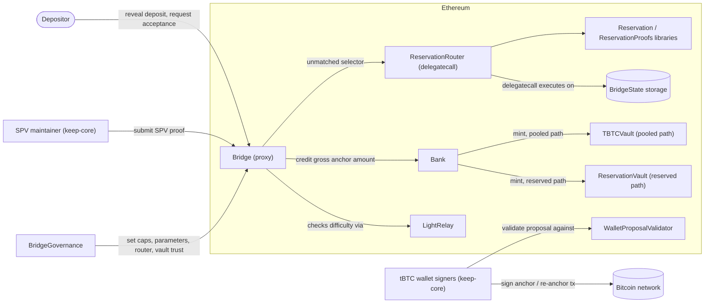
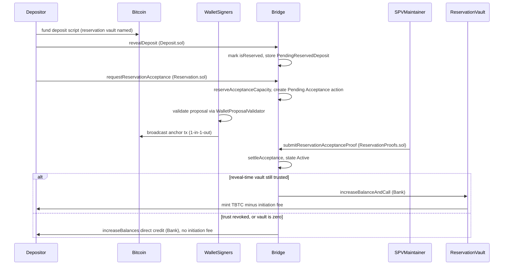
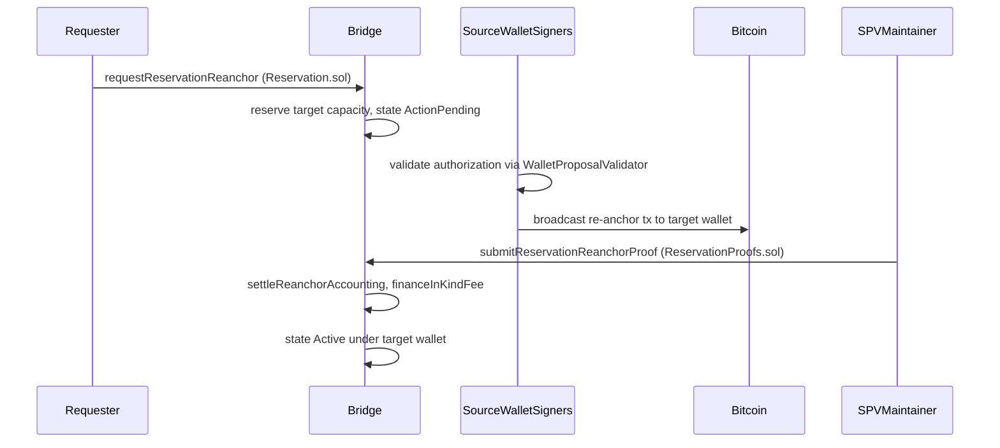
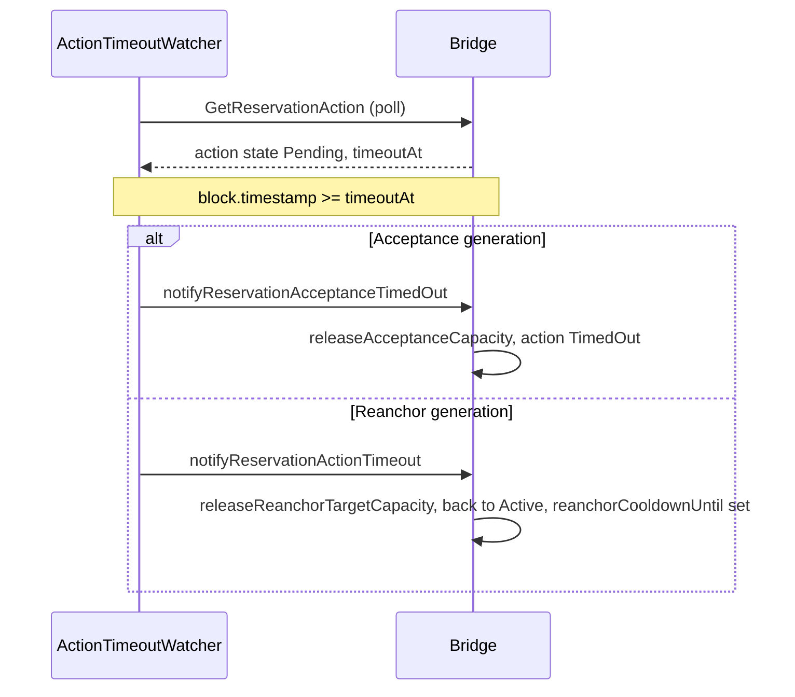
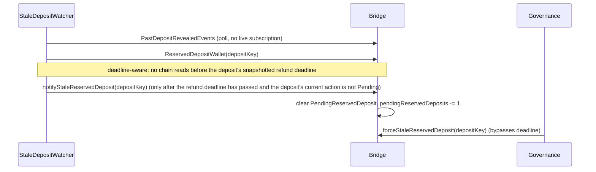
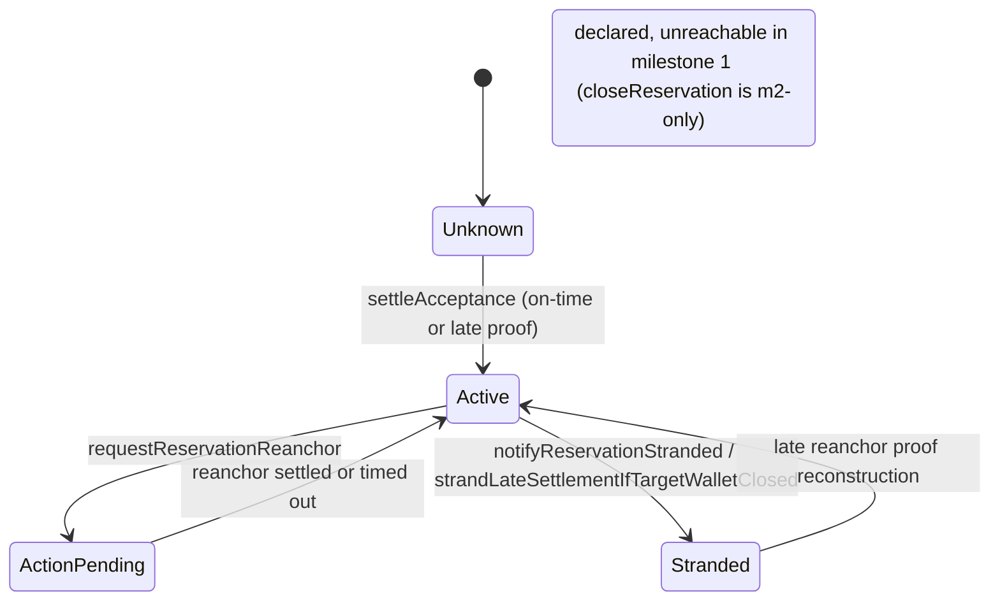
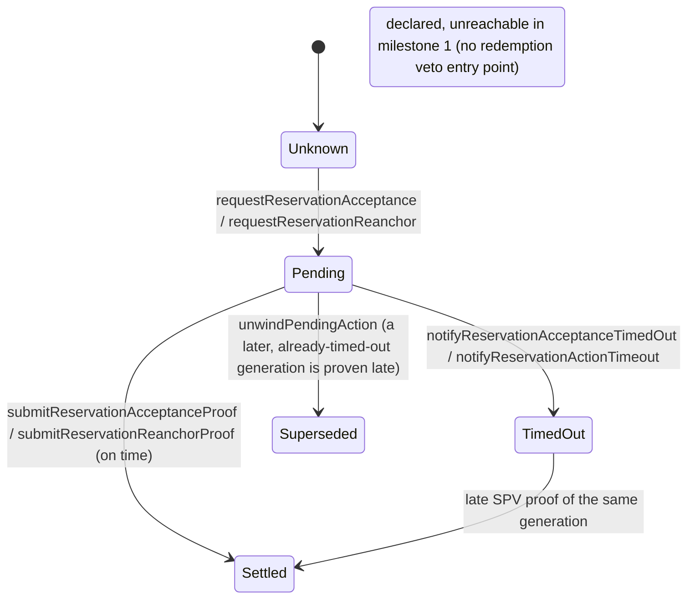

# UTXO Reservations — Milestone 1 Architecture

Status: 2026-09-28 draft, grounded in the M1 code — tbtc-v2 `reservations-upgrade` @
`9f8f5ef1` (Solidity: Bridge, `Reservation`/`ReservationProofs` libraries, `ReservationRouter`,
`ReservationVault`) and keep-core `reservations-epic` @ `f66f11240` (Go: wallet-side proposal
tasks, SPV proof loop, watchers). This code is implemented on integration branches. It is **not**
merged to `dev`/`main`, **not** audited, and **not** deployed to any live network. Tracker PRs:
tbtc-v2 #1116 (`reservations-upgrade` → `dev`, open draft) and keep-core #4282
(`reservations-epic` → `dev`, open draft). Every function and line reference below was verified
against those base snapshots, then corrected against keep-core `e28df49ba`
([#4343](https://github.com/threshold-network/keep-core/pull/4343)) and
tbtc-v2 `e635e229` ([#1161](https://github.com/threshold-network/tbtc-v2/pull/1161));
lines moved by the fix commits are annotated as such (for example, "fix branch: :154").

This document describes milestone 1 (variant B: creation, custody and re-anchor only — no
in-kind redemption, no renewal, no dissolution). For the full multi-milestone design those
features belong to, see `feature-spec.md`; for the milestone-1/milestone-2 split rationale, see
`m1-b-implementation.md` and `roadmap.md`.

---

## 1. System context



A depositor sends bitcoin to a tBTC threshold wallet's deposit script and reveals it to the
Bridge naming `ReservationVault` as the deposit's vault (`Deposit.revealDeposit` /
`_revealDeposit`). That single flag — `reveal.vault == self.reservationVault` — is the only
thing that distinguishes a "reserved" deposit from an ordinary pooled one; everything downstream
branches on it. The depositor then calls `requestReservationAcceptance` on the Bridge, which is
really a call into `ReservationRouter` reached through the Bridge's fallback function: the router
holds the entire reservation surface as a `delegatecall` extension so it executes on the Bridge's
own storage, address and Bank authority, but its bytecode lives outside the monolithic `Bridge`
implementation (see §2). The wallet's signers, running keep-core, watch for authorized actions,
build and sign the required 1-input-1-output Bitcoin transaction, and broadcast it. A trusted SPV
maintainer (also keep-core) proves that transaction to the Bridge, which settles the position,
checks it against `LightRelay`'s difficulty data, and credits the gross anchor amount through the
Bank to `ReservationVault`. `ReservationVault` mints TBTC and forwards it to the depositor minus
an initiation fee, in parallel with (but structurally separate from) the pooled `TBTCVault` path
ordinary deposits use. One reachable exception (detailed in §5.1): if governance revokes the
reveal-time vault's trust before a late proof settles, the settlement instead credits the
depositor directly through the Bank and no initiation fee is charged.
`BridgeGovernance` is the only path that can set the router, trust the
vault, or change reservation parameters and caps, always through the same governance-delay
machinery the rest of the Bridge uses.

---

## 2. On-chain components

| Component | Responsibility | Storage owned | Who may call | Upgrade path |
|---|---|---|---|---|
| `Bridge` (proxy) | Holds every Bridge selector directly declared on it (deposits, sweeps, redemptions, wallet lifecycle, fraud) plus the fallback that routes unmatched selectors to the router. Exposes `getReservationRouter()` as its own view (distinct from the router's own `reservationRouter()` view) so the router address is readable even before it is reached through the fallback. | `BridgeState.Storage` (the single struct backing both `Bridge` and `ReservationRouter`) | Anyone (public entry points), `onlyGovernance` (parameter/router/vault-trust setters), `onlySpvMaintainer` (proofs) | Transparent proxy; implementation upgrade via the proxy admin |
| `ReservationRouter` | Delegatecall extension holding all 22 reservation-specific external entry points (11 state-changing + 11 views, enumerated below) | None of its own — declares exactly one storage variable, `BridgeState.Storage internal self`, aligned to the same slots as the Bridge (`ReservationRouter.sol:59-68`) | Same callers as the entry point it implements; direct calls (not through the Bridge fallback) hit its own empty storage and every state-changing entry point reverts | Bridge implementation upgrade (see `setReservationRouter`, §7) |
| `Reservation` library | Control plane: request/authorization side of acceptance and re-anchor, capacity accounting, stranding, stale-deposit cleanup, parameter/cap governance setters | None (operates on `BridgeState.Storage` passed by reference) | Invoked only through `ReservationRouter`/`Bridge` | Ships as part of the router's code; same upgrade path |
| `ReservationProofs` library | Settlement plane: the two-phase SPV proof dispatcher and the acceptance/re-anchor settlement logic. The acceptance settlement credits the reveal-time vault only while it is still trusted; otherwise it credits the depositor directly through `bank.increaseBalances` and no initiation fee is charged (§5.1). | None (operates on `BridgeState.Storage` passed by reference) | Invoked only through `ReservationRouter` (`submitReservationAcceptanceProof`, `submitReservationReanchorProof`) | Same as `Reservation` |
| `BridgeState` (library + storage struct) | Owns the `Storage` layout shared by `Bridge` and `ReservationRouter`, including every reservation field and the `__gap` (§7) | The canonical storage of the whole Bridge, including `reservations`, `reservationActions`, `walletReservationInfo`, `pendingReservedDeposit`, `reservationsByAnchorUtxo` | Internal; also declares `setReservationRouter` | N/A (a library, not a deployed contract) |
| `ReservationVault` | Liability-side companion: mints TBTC against a proven anchor, charges the initiation fee, finances in-kind re-anchor miner fees, holds the fee reserve/debt | Its own contract storage: `initiationFeeBps`, `feeReserveTarget`, `inKindFeeDebtSat` | `onlyBank` (`receiveBalanceIncrease`), `onlyOwner` (fee/target setters, `sweepFees`), Bridge-only (`financeInKindFee`, `msg.sender == address(bridge)`), anyone (`repayInKindFeeDebt`) | Plain `Ownable`, **not** proxy-upgradeable — replacing it means deploying a new vault and re-pointing `Bridge.reservationVault` (§7) |
| `TBTCVault` | Pooled-path mint/redeem vault; unrelated code path reservations never call, kept here only for contrast in the diagram | Its own contract storage | N/A to reservations | N/A to reservations |
| `Bank` | Ledger of TBTC-backing satoshi balances; the trusted intermediary every mint/burn passes through (`increaseBalanceAndCall`, `increaseBalances`, `decreaseBalance`) | Balance mapping | Bridge-only for balance mutation | Not reservation-specific |
| `WalletProposalValidator` | Off-chain-facing, on-chain-readable constants and pure validation helpers (`DEPOSIT_MIN_AGE`, `DEPOSIT_REFUND_SAFETY_MARGIN`, `REQUEST_TIMEOUT_SAFETY_MARGIN`) that both the Bridge's own requires and keep-core's wallet signers consult so a proposal that would fail on-chain is rejected before a signature is ever produced | Constants only | Read-only | N/A |
| `LightRelay` (`IRelay`) | Supplies current Bitcoin network difficulty for SPV proof validation | Its own contract | Read-only from the Bridge | Not reservation-specific |
| `BridgeGovernance` | Owner-gated governance surface: stages/finalizes `updateReservationParameters` and `updateReservationCaps` behind a governance delay, and makes the one-off `setReservationRouter` / `setVaultStatus` calls | Its own staging structs (`BridgeGovernanceParameters.ReservationData`, `ReservationCapsData`) | `onlyOwner` (the Council Safe in production) | N/A |

### 2.1 Router entry points

`ReservationRouter.sol` declares exactly 22 external functions: 11 state-changing and 11 views.
There is no `submitReservationProof` entry point on the router — the identically-named function
in `ReservationProofs` is an internal dispatcher, never called directly; the router instead
exposes it as two typed entry points, `submitReservationAcceptanceProof` and
`submitReservationReanchorProof`. There is also no `walletReservations` view.

State-changing (grouped by who calls them):

| Group | Entry points |
|---|---|
| Depositor-initiated | `requestReservationAcceptance` |
| Permissionless (source-retiring) / governance (source Live) | `requestReservationReanchor` |
| `onlySpvMaintainer` | `submitReservationAcceptanceProof`, `submitReservationReanchorProof` |
| Permissionless cleanup | `notifyReservationActionTimeout`, `notifyReservationAcceptanceTimedOut`, `notifyStaleReservedDeposit`, `notifyReservationStranded` |
| `onlyGovernance` | `updateReservationParameters`, `updateReservationCaps`, `forceStaleReservedDeposit` |

Views: `reservationCaps`, `walletReservationsAmount`, `walletReservationsCount`,
`reservationByAnchorUtxo`, `reservedDepositWallet`, `pendingReservedDeposits`, `reservations`,
`reservationActions`, `reservationParameters`, `activeReservationsCount`, `reservationRouter`.

`notifyReservationAcceptanceTimedOut` and `forceStaleReservedDeposit` are genuinely new milestone-1
entry points, not present in the pre-fold reference stack: the first closes a gap left once
`notifyReservationActionTimeout` was narrowed to the `Reanchor` action type only (an unsigned
acceptance authorization would otherwise have no permissionless release path); the second is a
governance override of `notifyStaleReservedDeposit` that clears a pending reserved deposit before
its self-chosen refund deadline, defending against a malicious depositor grinding
`pendingReservedDeposits` with a refund deadline set far in the future.

### 2.2 Why a delegatecall router, and its invariants

Adding the reservation surface directly to `Bridge` pushed its deployed bytecode over the EIP-170
24,576-byte limit. `Bridge` instead stores one address, `BridgeState.Storage.reservationRouter`,
and its fallback function `delegatecall`s any unmatched selector to that address
(`Bridge.sol:2132-2153`). Router code then executes at the Bridge's own address, on the
Bridge's own storage, with the Bridge's own Bank authority — exactly as if it had been declared
in `Bridge.sol` — while its bytecode lives in a separately deployed contract with its own 24 kB
budget. An external-contract-with-callbacks alternative was rejected because reservations mutate
core Bridge state (`deposits`, `registeredWallets`, `spentMainUTXOs`) and exercise Bank authority
reserved for the Bridge address; giving an external contract that authority would need a wide set
of new privileged Bridge mutators — more bytecode than the split saves, and a new trusted-party
surface to audit.

Four invariants are enforced by construction and asserted by tests:

1. **Storage parity.** The router inherits the same storage-bearing bases as the Bridge, in the
   same order, and declares exactly one storage variable, `BridgeState.Storage internal self`
   (`ReservationRouter.sol:59-68`). New reservation state is appended to `BridgeState.Storage`
   with a matching `__gap` reduction (§7).
2. **No selector shadowing.** A selector the Bridge itself declares never reaches the router,
   because the fallback only sees unmatched calls (`ReservationRouter.sol:70-80`). The one
   documented exception is the `Governable`/`Initializable` base functions the two contracts
   share identically to keep their storage layouts aligned; the router's own copies of those are
   permanently unreachable through the fallback and are inert.
3. **No standalone authority.** A direct call to the router (bypassing the Bridge fallback)
   executes on the router's own, empty storage: governance is unset, no SPV maintainer is
   approved, the reservation vault is the zero address, and the router holds no Bank balance —
   every state-changing entry point reverts (`ReservationRouter.sol:82-87`).
4. **One-time setter.** `BridgeState.setReservationRouter` (`BridgeState.sol:1077-1098`) requires
   `self.reservationRouter == address(0)`, a non-zero address, and that the target actually has
   code deployed at it, then sets it — irreversibly. Replacing router code afterward requires a
   full Bridge implementation upgrade (the proxy-admin ceremony), not a parameter-governance
   transaction, because pointing the delegatecall target at new code is itself an implementation
   change.

---

## 3. Off-chain components (keep-core)

### 3.1 Wallet-side proposal tasks (coordination leader)

`tbtcpg.NewProposalGenerator` appends two extra tasks to the standard sweep/redemption/heartbeat/
moving-funds/moved-funds-sweep task list only when `reservationsEnabled` is true
(`pkg/tbtcpg/tbtcpg.go:90-127`):

- **`ReservationAcceptanceTask`** (`pkg/tbtcpg/reservation_acceptance.go`) consumes
  the `Pending` `Acceptance` actions that the depositor created on-chain: it
  selects deposits whose current action is a `Pending` Acceptance (a deposit
  with no pending action is skipped, because its owner has not requested
  acceptance yet) and, per candidate, checks that the wallet is `Live` or
  `MovingFunds` (mirroring the validator's `requireWalletLiveOrMovingFunds`),
  that the deposit is old enough and unswept, and that the generation's
  signing window still has more than the validator's
  `REQUEST_TIMEOUT_SAFETY_MARGIN` left (a generation at or past
  `now + 7200 >= TimeoutAt` is skipped). It does not re-check the
  request-time capacity caps: the Bridge already reserved the active count,
  wallet count/amount, and global total capacity when
  `requestReservationAcceptance` ran, so the deleted
  `checkReservationAcceptanceEligibility` cap gate is no longer applied on
  this path (caps are read client-side only where fresh requests are made,
  i.e. the re-anchor task's target headroom pre-check). The proposal is then
  built from that action's real `requestNonce` and snapshotted values
  (`minAmount`, `txMaxFee`, `timeoutAt`), validated against the on-chain
  action (including the snapshotted minimum `action.MinAmount` plus the
  estimated anchor fee), and
  dispatched as a `ReservationAnchorProposal`. The task itself never calls
  `RequestReservationAcceptance` from the operator account: only the
  depositor may create the action on-chain, so the task merely consumes it.
- **`ReservationReanchorTask`** (`pkg/tbtcpg/reservation_reanchor.go`) fires once a wallet enters
  `StateMovingFunds`: for each reservation the wallet still custodies, it submits
  `RequestReservationReanchor` on the Bridge, which returns the transaction hash.
  The task records each submission in an in-memory per-reservation in-flight
  map; in later rounds it resolves the receipt of any unresolved request before
  doing anything else - a mined receipt resumes the generation without issuing
  a new request (re-reading the reservation and the resulting action to obtain
  the actual `ReservationReanchorProposal`), a reverted receipt allows a fresh
  request, a still-pending receipt skips that reservation for the round, and a
  request not observed more than 6 blocks after its submission is treated as
  dropped, which also allows a fresh request. The map is in memory only: after
  a process restart, the resume is driven by the chain state (a `Pending`
  Reanchor action) instead, and the resume path skips a generation whose
  signing window is inside the validator's timeout safety margin
  (`now + 7200 >= TimeoutAt`). Within the round a fresh request was just made,
  a same-round fast path polls for up to 6 blocks for the transaction to be
  mined before building the proposal. Target selection is per
  reservation: a target's count and amount headroom are checked against the current caps and
  the reservation's anchor amount (a cached target without room is evicted and the next
  candidate tried, including after a cap revert), so a full wallet is not
  re-picked by every later round. Once a
  `MovingFunds` wallet's reservation count has drained to zero, the same task also checks
  whether the wallet's main UTXO has fallen below the moving-funds dust threshold and, if so,
  calls `notifyMovingFundsBelowDustIfEligible` (the permissionless
  `MovingFunds.notifyMovingFundsBelowDust` path) so that a wallet which proved its funds
  moved while still holding reservation anchors can finish closing once those anchors are
  gone (see §5.2, §6.3). Re-anchor off a `Live` source wallet requires a governance
  (`privileged`) caller, which the client's ordinary operator key can never satisfy, so this
  task never attempts one. The Bridge accepts a permissionless re-anchor request from a
  `Closing` source wallet exactly as readily as a `MovingFunds` one
  (`Reservation.sol:722-858`), but this task's own trigger checks
  `StateMovingFunds` only (`pkg/tbtcpg/reservation_reanchor.go:195`; the M1 pinned tip used `:139`) - a `Closing` wallet still
  custodying reservations has no automated re-anchor caller in M1 and depends on a manual,
  permissionless call (§6.3).

`pkg/tbtc/coordination.go` adds `ActionReservationAnchor`/`ActionReservationReanchor` to every
wallet's per-window action checklist, unconditionally, once the coordination block reaches a
per-network `ReservationsActivationBlock` — unlike the throughput-driven sweep/moving-funds
actions, reservation actions are not frequency-gated, because a delayed acceptance or re-anchor
risks the on-chain `reservationActionTimeout` firing before the wallet gets a chance to act. The
activation block is derived per-network rather than read from local config so a follower whose
config diverges from the leader's cannot mistake an honest leader's reservation proposal for a
protocol fault.

### 3.2 Wallet-side execution

A proposal that survives `WalletProposalValidator`'s checks is dispatched as a `walletAction`:
`reservationAnchorAction`/`reservationReanchorAction` (`pkg/tbtc/reservation.go`) assemble the
1-input-1-output Bitcoin transaction (`AssembleReservationAnchorTransaction` /
`AssembleReservationReanchorTransaction`), drive the threshold signing executor, broadcast it to
Bitcoin, and monitor for confirmation/replacement.

### 3.3 SPV maintainer proof loop

`pkg/maintainer/spv/reservation_proof_loop.go` runs `maintainReservationProofs` as a dedicated
loop, separate from the maintainer's generic proof-submission control loop, because
`submitReservationAcceptanceProof`/`submitReservationReanchorProof` each need the
`(reservationKey, requestNonce)` pair identifying the action generation, which the generic
proof-submitter interfaces (shared with deposit sweep, redemption, moving funds) cannot carry.
Each pass incrementally scans for new `ReservationAcceptanceRequested`/`ReservationReanchorRequested`
events, matches them against each wallet's confirmed Bitcoin transaction history, and keeps
every `Pending` **and** `TimedOut` generation as a proof candidate through the contract's
settlement window, so it submits an SPV proof once a matching transaction has enough
confirmations (`proveReservationAcceptanceActions`, `proveReservationReanchorActions`). The
matchers accept both P2PKH and P2WPKH outputs paying the authorized public key hash,
mirroring `BitcoinTx.sol`'s `extractPubKeyHash`, so a settlement broadcast in either
encoding is provable. A `TimedOut` generation is only evicted once the
contract's own window closes: late acceptance settlement is bounded to
`timeoutAt + termSeconds`, where `termSeconds` is the custody term snapshotted
onto the action when its generation was requested (the live
`reservationTermSeconds` parameter does not shrink that window; see
`ReservationProofs.sol` `loadSettleableAction`), while late re-anchor
settlement has no bound; states that can no longer settle (`Settled`,
`Superseded`, and the non-settleable `TimedOut`-past-its-window) are the
ones the loop drops.

### 3.4 Watchers

Three watchers, wired together by `spv.WireReservationWatchers`
(`pkg/maintainer/spv/reservation_wiring.go`):

| Watcher | Watches | Calls |
|---|---|---|
| `ReservationActionTimeoutWatcher` | Every tracked reservation's current pending action generation, once its `timeoutAt` has elapsed | `notifyReservationAcceptanceTimedOut` (Acceptance-type actions) or `notifyReservationActionTimeout` (Reanchor-type actions); branches on `action.ActionType` |
 | `ReservationStaleDepositWatcher` | Every revealed reserved deposit until its wallet field reads zero on-chain (`ReservedDepositWallet(depositKey) == 0`; every release path emits the `ReservedDepositMarkedStale` event in the same transaction, so a cleared read is corroborated by that event) (no live `DepositRevealed` subscription exists in M1, so discovery falls back to a polled `PastDepositRevealedEvents` scan); each deposit's chain reads are scheduled from its snapshotted refund deadline, with no chain reads before the deadline | `notifyStaleReservedDeposit`, only once the snapshotted refund deadline has passed and the deposit's current action is not `Pending`, regardless of the designated wallet's state; the first attempt per deposit is deterministically staggered per operator by up to a ten-minute offset after the deadline (later retries back off the same interval), so many operators discovering the same overdue deposit do not collide on-chain |
| `reservationStrandingWatcher` | `WalletClosed`/wallet-termination events (`StateClosed`/`StateTerminated` only — see below), resolved to the terminated/closed wallet's reservation set (the client-side `ChainAdapter.WalletReservations` call: derived from reservation events, since no Bridge enumeration view exists) | `notifyReservationStranded` for every `Active` reservation the wallet still custodies |

All three are mandatory, permissionless, network-wide duties rather than leader-election duties:
every process capable of driving them runs `WireReservationWatchers` once at startup, gated on its
own reservation-enabling flag. A `Notify*` call against an already-notified or already-settled
reservation is a no-op on the Bridge, so redundant wiring across two processes sharing a
deployment is harmless.

The action-timeout watcher's deadline boundary matches the contract's: a generation is
considered overdue as soon as `now >= timeoutAt` (the watcher skips it only while
 `now < timeoutAt`), so the exact deadline second is eligible. The stale-deposit watcher's
 companion rules are the snapshotted refund deadline (no chain reads before it,
 and the deposit retires once the `ReservedDepositWallet` read observes zero) and
 a deterministic per-operator first-attempt stagger after the deadline, up to
 ten minutes. Watcher-goroutine death is a decided M1
 requirement (a clientinfo metric distinct from transient per-tick errors), not just a
 log line; `fix/m1-cross-repo-review` implements it as the counter
 `spv_reservation_watcher_deaths_total`, wired into both the client and
 maintainer watcher-startup paths; the recorder tolerates a typed-nil
 metrics recorder (`cmd/start.go` normalizes the `*clientinfo.PerformanceMetrics`
 pointer to a true nil interface before the call, and
 `recordReservationWatcherDeath` treats a typed-nil value as a disabled
 recorder), so a disabled client-info pipeline cannot panic the watcher
 goroutines.
Restart recovery: the SPV proof loop and the stale-deposit watcher start
their first scan at `tbtc.ReservationsActivationBlock(network)` with
chunked event queries (a network without an activation entry, the
`math.MaxUint64` sentinel, skips the startup scan and jumps the cursor to
the head), instead of a fixed 30-day lookback; the action-timeout watcher's
first pass keeps a bounded 30-day catch-up window clamped to the activation
block when it falls within that window. The network is threaded through
`Config.EthereumNetwork` in the maintainer and through the
`WireReservationWatchers` parameter in the client.

None of the three watchers extends to a `Closing` wallet: the stranding watcher's only trigger is
`OnWalletClosed` (plus the equivalent startup/recheck scans in `reservation_wiring.go` and
`reservation_action_timeout_watch.go`), so it never observes a `Closing` wallet crossing
`dissolutionEligibleAt`. The re-anchor side has the same shape: `ReservationReanchorTask` (§3.1)
triggers only on `StateMovingFunds`, never `StateClosing`, even though `Reservation.sol` accepts a
permissionless call for either source state (§6.3). Both gaps have a safe on-chain backstop —
anyone may call `notifyReservationStranded`/`requestReservationReanchor` directly — so neither is
launch-blocking, but neither is automated in M1 (`m1-keep-core-readiness/01-gap-analysis.md`,
"Stranding coverage gap for `Closing`-past-`dissolutionEligibleAt` wallets").

### 3.5 Config flags

- `Tbtc.ReservationsEnabled` (client `start` process) gates reservation proposal generation,
  reservation watcher wiring from `cmd/start.go`, and reservation metrics registration. It does
  **not** gate reservation action *execution*: once a network's activation block is reached, every
  wallet signer validates, co-signs, and broadcasts reservation proposals regardless of this flag
  (§4).
- `Maintainer.Spv.ReservationProofsEnabled` (maintainer process) gates SPV proof submission and
  that process's own watcher wiring.
- An operator running both roles must enable both flags for end-to-end operation;
  `WireReservationWatchers` runs a best-effort misconfiguration self-check (an asynchronous
  warning, not a hard failure) when one flag is unset and all three watchers' startup scans
  definitively find zero on-chain reservation activity.

---

## 4. Trust boundaries and roles

| Actor | Can | Cannot |
|---|---|---|
| Depositor | Reveal a reserved deposit; request its acceptance; receive the minted TBTC; repay in-kind fee debt; request a re-anchor off a retiring wallet | Redeem, renew, or dissolve the position in M1; spend the anchor directly; force acceptance of someone else's deposit |
| tBTC wallet signers (keep-core) | Choose to build P2WPKH anchor/re-anchor outputs (a client convention, not an on-chain rule — see below); sign only authorized actions | Sign an unauthorized action without exposing the wallet to the fraud-challenge/slashing path; include a reserved deposit in an ordinary sweep (Bridge- and signer-enforced) |
| SPV maintainer | Submit proofs of confirmed acceptance/re-anchor transactions | Forge a proof or settle against a different generation than the one it names; only `onlySpvMaintainer`-approved addresses may call the proof entry points |
| Watchers (any address, keep-core software in practice) | File any permissionless notify call: action timeout, stale deposit, stranding | Grant, block, or speed up anything; every notify call is idempotent and rewardless |
| `BridgeGovernance` (Council Safe, delay-gated) | Set reservation parameters and caps (48h delay); set the router and vault trust status (no delay, one-off) | Bypass the on-chain relational/bounds checks in `updateReservationParameters`/`updateReservationCaps`; re-point the vault while any reservation is open (§7) |
| Anyone | Repay `inKindFeeDebtSat`; request a re-anchor off a `MovingFunds`/`Closing` source wallet; file any housekeeping notify call | Request acceptance for someone else's deposit; re-anchor off a `Live` wallet (governance-only); target any wallet other than a `Live` one |

**On-chain vs. client convention.** The Bridge's `extractPubKeyHash` accepts either a P2PKH or a
P2WPKH output (`BitcoinTx.sol:337-368`, both script lengths handled); nothing on-chain requires
P2WPKH. keep-core's own transaction-assembly code happens to always build P2WPKH outputs
(`AssembleReservationAnchorTransaction`/`AssembleReservationReanchorTransaction`). That is a
client-side choice, not a protocol guarantee — a different signer implementation could produce a
valid P2PKH anchor and the Bridge would accept it.

---

## 5. Flows

### 5.1 Deposit reveal and acceptance



`_revealDeposit` (`Deposit.sol:198-253`) sets `isReserved` from `reveal.vault == self.reservationVault`
and, for reserved deposits, always records the exact Bitcoin refund locktime as `refundDeadline`
(capped to at most `reservationTermSeconds` plus a safety margin past reveal time), even when the
global reveal-ahead validation is disabled — a permissionless acceptance request must never be
able to reserve capacity for an authorization window the wallet validator can never sign inside.
`requestReservationAcceptance` (`Reservation.sol:487-638`) then requires: the caller is the
deposit's own depositor; the deposit is revealed, reserved, routed to the trusted vault, and
unswept; the named wallet is the deposit's designated wallet and is `Live`; the deposit amount
covers `reservationMinAmount + reservationTxMaxFee`; and there is a non-empty signing window
between `DEPOSIT_MIN_AGE` past reveal and the refund deadline minus its safety margin. It reserves
capacity (`reserveAcceptanceCapacity`) against the global occupancy cap
(`maxActiveReservations`), the global amount cap, and the per-wallet count/amount caps, and
snapshots a `Pending` `Acceptance` action with `timeoutAt`. Settlement
(`ReservationProofs.settleAcceptance`, `ReservationProofs.sol:473-626`) validates the 1-input-1-output
shape, writes the reservation record (`owner`, `mintedAmount = anchorAmount`, `expiresAt`,
`dissolutionEligibleAt`), and credits the gross anchor amount through the Bank to the vault named
at reveal time (not necessarily the live `reservationVault`, in case governance re-pointed it
between request and a late proof). That credit is gated on the vault's trust at settlement time:
if the reveal-time vault is still trusted, the Bridge credits it via
`bank.increaseBalanceAndCall` and the vault mints TBTC for the depositor minus its initiation fee.
If governance revoked that trust (`setVaultStatus(vault, false)`, `Bridge.sol:1288-1293`) after
the acceptance was authorized but before the proof settled, the fallback credits the depositor
directly through `bank.increaseBalances`: the vault never sees the amount, mints nothing, and no
initiation fee is charged for that settlement (`ReservationProofs.sol:616-625`). The fallback is
deliberate: settlement of an already-confirmed Bitcoin spend must not revert just because the
vault lost trust in the interim. If the acceptance's target wallet has already left `Live`
(`Closing`, `Closed`, or `Terminated`) by settlement time, the position is stranded immediately
instead of being left briefly un-stranded (`strandLateSettlementIfTargetWalletClosed`).

### 5.2 Re-anchor



`requestReservationReanchor` (`Reservation.sol:722-858`) is milestone 1's only unpin path: the
reservation must be `Active` and off cooldown; the source wallet must be `MovingFunds` or
`Closing` (permissionless caller) or `Live` (governance-only, `privileged`); the target must be a
different, `Live` wallet with count and amount headroom; and the anchor must stay above
`reservationMinAmount + reservationTxMaxFee` — the only on-chain bound limiting how far repeated
re-anchor hops can grind an anchor down before settlement-time dust checks would otherwise let it.
The re-anchor eligibility gate that the reference design keys off `dissolutionEligibleAt` is
deliberately absent in M1: re-anchor is unbounded in time because there is no dissolution path yet
to bound it against. Settlement (`ReservationProofs.submitReservationReanchorProof`,
`ReservationProofs.sol:640-762`) validates the re-anchor Bitcoin transaction and calls
`settleReanchorAccounting` (`ReservationProofs.sol:779-809`), which releases the source wallet's
capacity, applies the per-hop miner-fee delta to the tracked claim, accumulates it into
`cumulativeReanchorFee`, and migrates the reverse anchor index. Back in
`submitReservationReanchorProof`, and — before returning — it calls
`IReservationFeeFinancer.financeInKindFee` on the deposit's vault (the only external call in the
function, made last, after every internal effect, including the stranding check, has committed).
`ReservationVault.financeInKindFee` burns TBTC from its fee reserve to cover the miner fee; any
shortfall becomes public, repayable `inKindFeeDebtSat` rather than blocking settlement — a
confirmed Bitcoin spend must never fail to settle for lack of reserve.

### 5.3 Action timeouts



The Bridge exposes two distinct timeout entry points because the two action types release
different capacity and land in different states. `notifyReservationAcceptanceTimedOut`
(`Reservation.sol:655-691`) requires the current generation to be a `Pending` `Acceptance` past
its `timeoutAt`; it releases the capacity reserved at request time and marks the action
`TimedOut` — the *reservation* itself stays `Unknown`, so a fresh acceptance can be requested for
the same deposit. `notifyReservationActionTimeout` (`Reservation.sol:860-914`) requires a `Pending`
`Reanchor` action on a reservation in `ActionPending`; it releases the *target* wallet's reserved
capacity, returns the reservation to `Active` under its original (source) wallet, and sets
`reanchorCooldownUntil` for non-privileged callers. Either terminal record still accepts a late SPV
proof of the (already-broadcast, already-confirmed) Bitcoin transaction it authorized — a timeout
notification races the wallet's own broadcast, it does not invalidate it.

### 5.4 Stranding

```mermaid
sequenceDiagram
  participant Chain as WalletClosedEvent
  participant Strand as StrandingWatcher
  participant Adapter as ChainAdapter
  participant Anyone
  participant Bridge
  alt Wallet reached Closed or Terminated
    Chain->>Strand: OnWalletClosed(walletID)
    Strand->>Strand: resolve wallet public key hash
    Strand->>Adapter: WalletReservations(walletPubKeyHash) (client-side, event-derived; no Bridge enumeration view exists)
    loop each Active reservation
      Strand->>Bridge: notifyReservationStranded(reservationKey)
      Bridge->>Bridge: require wallet Terminated or Closed
      Bridge->>Bridge: strandReservation - release capacity, state Stranded
    end
  else Wallet is Closing past dissolutionEligibleAt
    Note over Strand,Bridge: no keep-core watcher triggers this branch in M1
    Anyone->>Bridge: notifyReservationStranded(reservationKey)
    Bridge->>Bridge: require now >= dissolutionEligibleAt
    Bridge->>Bridge: strandReservation - release capacity, state Stranded
  end
```

`notifyReservationStranded` (`Reservation.sol:1090-1115`) requires the reservation to be `Active`
(a reservation with a pending action must settle, time out, or — since M1 has no veto — simply
settle first) and the custodying wallet to be `Terminated`, `Closed`, or `Closing` with
`block.timestamp >= reservation.dissolutionEligibleAt`. The `Closing`-with-deadline branch exists
so a legitimate in-flight re-anchor (which `requestReservationReanchor` accepts from a `Closing`
source) is never raced by a permissionless strand before the deadline; both a re-anchor request
and a strand require `state == Active` as their own precondition, so whichever transaction lands
first flips the state and the other reverts. `strandReservation` (`Reservation.sol:989-1028`)
releases the wallet's and the global tracked capacity, deletes the reverse anchor index entry, and
sets the reservation `Stranded`; the anchor is deliberately *not* marked as honestly spent, so a
terminated wallet's actual spend of it stays visible to the fraud/dispute record. Nothing about
the depositor's already-minted TBTC balance changes — stranding only removes the in-kind option,
not the claim.

keep-core's `reservationStrandingWatcher` (§3.4) drives the `Terminated`/`Closed` branch above
automatically, through its `OnWalletClosed` subscription and startup catch-up scan; the
`Closing`-past-deadline branch has no automated caller in M1, so a wallet stuck there relies on
`notifyReservationStranded` being called manually as the permissionless backstop (§6.3).

### 5.5 Stale reserved deposits



`notifyStaleReservedDeposit` (`Reservation.sol:1127-1165`) requires a still-pending reserved
deposit, that the deposit's current action is not `Pending`, and that the exact Bitcoin refund
deadline captured at reveal time has elapsed (regardless of the designated wallet's current
state); it clears the pending-deposit record and
decrements `pendingReservedDeposits`, freeing the deposit to become refundable through its own
Bitcoin script and — not incidentally — unblocking a future `reservationVault` re-point, which is
gated on `pendingReservedDeposits == 0` (§7). `forceStaleReservedDeposit`
(`Reservation.sol:1183-1213`) is the same clearing logic without the deadline check, callable only
by governance: a malicious depositor could otherwise reveal a reserved deposit with a refund
deadline far in the future and never fund the anchor, permanently grinding the pending-deposit
guard against every other depositor with no permissionless recovery until the self-chosen deadline
arrives.

---

## 6. State machines

### 6.1 Reservation state



`ReservationState` has five values (`Unknown(0) | Active(1) | ActionPending(2) | Closed(3) |
Stranded(4)`, `Reservation.sol:74-105`). A pending acceptance authorization is tracked entirely
through its `ReservationAction` record; the reservation position itself stays `Unknown` until
settlement, so `ActionPending` is never set for an acceptance. `closeReservation`
(`Reservation.sol:1039-1064`) — the transition into `Closed` — has no milestone-1 caller: its own
doc comment names its intended call sites as the milestone-2 redemption and dissolution settlement
paths, "both currently unreachable in m1". The one transition that runs against intuition is
`Stranded → Active`: a signed, confirmed re-anchor transaction can still be proven with no time
limit, and if the position was stranded in the interim (its custodying wallet finished
terminating/closing after the re-anchor was authorized but before it was proven),
`prepareReservationForSettlement` (`ReservationProofs.sol:262-304`) reconstructs the position's
tracked capacity before ordinary settlement proceeds — a late, honest proof is never refused just
because bookkeeping had already written the position off.

### 6.2 Action state



`ActionState` has six values (`Unknown(0) | Pending(1) | Settled(2) | TimedOut(3) | Vetoed(4) |
Superseded(5)`, `Reservation.sol:119-143`). `Vetoed` exists purely for milestone-2 storage/layout
stability: the redemption watchtower veto entry point (`notifyReservedRedemptionVeto`) does not
exist on the milestone-1 router, so nothing can ever write this value. `Superseded` is reachable in
M1: when a `TimedOut` acceptance or re-anchor generation is later proven (a "late settlement"), any
*newer* generation still `Pending` against the same reservation had its authorized anchor consumed
out from under it and can never settle, so `unwindPendingAction` (`ReservationProofs.sol:819-859`)
marks it `Superseded` and releases whatever capacity it had reserved.

### 6.3 Wallet-state coupling

| Wallet state | Acceptance (designated wallet) | Re-anchor source | Re-anchor target | Stranding | Wallet closing |
|---|---|---|---|---|---|
| `Live` | Required | Governance-only (`privileged`) | Required | Not eligible | `moveFunds` begins closing immediately only if the reservation count is already zero (`Wallets.sol:607-639`) |
| `MovingFunds` | Not eligible | Permissionless | Not eligible | Not eligible | Blocked until reservation count reaches zero; then a below-dust report (`notifyMovingFundsBelowDust`) lets closing proceed |
| `Closing` | Not eligible | Permissionless on-chain, but no automated client trigger — `ReservationReanchorTask` fires only on `StateMovingFunds` (§3.1) | Not eligible | Eligible once `now >= dissolutionEligibleAt`, but no automated client trigger — `reservationStrandingWatcher` fires only on `Closed`/`Terminated` (§3.4) | `notifyWalletClosingPeriodElapsed` requires `walletReservationInfo[wallet].count == 0` (`Wallets.sol:360-387`) |
| `Closed` | Not eligible | Not eligible | Not eligible | Eligible | Terminal |
| `Terminated` | Not eligible | Not eligible | Not eligible | Eligible | Terminal |

The zero-reservation-count gate is enforced at exactly two points — the `moveFunds` routing
decision and `notifyWalletClosingPeriodElapsed` — and deliberately *not* inside
`beginWalletClosing`/`finalizeWalletClosing` themselves, since those two also run right after a
moving-funds Bitcoin transaction has already been proven on-chain, where blocking on a still-open
reservation would strand the wallet's own `movingFundsTimeout` clock instead of protecting
anything. A wallet whose main UTXO is already zero but which still custodies reservations
therefore still enters `MovingFunds` (not straight to `Closing`) purely so `WalletMovingFunds`
fires and triggers re-anchoring of its remaining anchors (`Wallets.sol:589-639`); keep-core's
`ReservationReanchorTask` is exactly the executor that drains that count and then reports the
below-dust condition (§3.1), closing what would otherwise be an unclaimed operational gap between
the contract's design and an actual client duty.

---

## 7. Storage layout and upgradeability

`BridgeState.Storage` carries the reservation feature's state directly (`BridgeState.sol:363-502`):

- `reservationMinAmount`, `reservationTermSeconds`, `reservationVault`, `reservationTxMaxFee`,
  `reservationDissolutionDelay`, `reservationMaxTotalAmount`, `reservationTotalAmount`,
  `maxReservationsPerWallet`, `reservationRouter`, `reservationActionTimeout`,
  `reservationRenewalWindowSeconds` (written for storage completeness; unread until renewal
  ships), `maxReservationsAmountPerWallet`, `reservationMaxSingleAmount`,
  `pendingReservedDeposits`, `activeReservationsCount`, `maxActiveReservations` — plain
  parameters and counters.
- `mapping(uint256 => Reservation.ReservationRequest) reservations` and
  `mapping(uint256 => Reservation.ReservationAction) reservationActions` — the position and
  per-generation records.
- `mapping(uint256 => uint256) reservationsByAnchorUtxo` — reverse index from an anchor's UTXO key
  to its reservation key, written at two sites (acceptance settlement and re-anchor settlement)
  and read by the `reservationByAnchorUtxo` view.
- `mapping(bytes20 => WalletReservationInfo) walletReservationInfo` — per-wallet `{ uint64 amount;
  uint32 count; }` packed into a single 12-byte, one-slot struct (`BridgeState.sol:61-64`).
- `mapping(uint256 => PendingReservedDeposit) pendingReservedDeposit` — reveal-time facts
  (`{ bool isReserved; bytes20 walletPubKeyHash; uint32 refundDeadline; bool
  refundDeadlineValidated; }`, one slot, `BridgeState.sol:36-58`); `isReserved` is permanent, the
  other three fields are cleared by staleness/acceptance but the permanent flag keeps the record
  recognizable as reservation-routed for the deposit's whole life.
- `uint256[39] __gap` (`BridgeState.sol:485-502`). The comment at that gap states the arithmetic
  directly: this milestone consumed 9 of the original 48 reserved slots for the reservation
  feature — down from an initial 15, after dropping `maxCumulativeReanchorFee`,
  `reservationDissolutionTxMaxFee`, `walletPendingDissolution`,
  `reservationRetryCreditActionNonce`, `reservationMaxBackingFractionBps`,
  `walletReservationKeys`, and `walletReservationKeyIndex` as unused/dead and re-packing the rest,
  freeing 6 slots. The remaining 39 slots are shared budget for every future Bridge upgrade, not
  reserved specifically for reservations.

`Reservation.ReservationRequest` (the per-position struct) additionally carries
`dissolutionEligibleAt` — set at acceptance/settlement time to `expiresAt +
reservationDissolutionDelay` and, per its own doc comment, never moved retroactively by a later
governance change to the delay. The re-anchor eligibility gate the reference design keyed off it
has been removed in milestone 1 (re-anchor is unbounded in time), but `dissolutionEligibleAt` is
not unread: `notifyReservationStranded`'s `Closing`-wallet branch requires
`block.timestamp >= reservation.dissolutionEligibleAt` (`Reservation.sol:1090-1115`), making that
branch the single milestone-1 on-chain reader. It is still a commitment recorded in storage for
milestone 2 to honour more broadly, not dead code to drop. `cumulativeReanchorFee` and
`reanchorCooldownUntil` are appended at
the end of the struct (safe without gap-scarcity, since a struct stored in a mapping needs no
`__gap` of its own).

**Router upgrade path.** `reservationRouter` is set exactly once via `BridgeState.setReservationRouter`
(`BridgeState.sol:1077-1098`, requiring the slot to be currently zero, the new address non-zero,
and code actually deployed there). Because the router was always going to be replaced by a Bridge
implementation upgrade for any future milestone that needs more reservation surface, minimising
what ships in milestone 1's router costs nothing extra later — the same upgrade ceremony milestone
2 needs anyway also gets to swap the router.

**Vault upgrade path.** `ReservationVault` is a plain `Ownable` contract, not a proxy, with its
`bank`/`tbtcVault`/`bridge` references baked in as immutables at construction. Re-pointing
`Bridge.reservationVault` to a different vault goes through `updateReservationParameters`
(`Reservation.sol:1300-1317`), which only permits the change while `self.reservationTotalAmount ==
0 && self.pendingReservedDeposits == 0` — total quiescence. Under milestone 1 (variant B), that
state is reachable only through complete wallet termination, stranding, or acceptance-timeout
release of every open position, because the voluntary early exits (redemption, dissolution) that
would otherwise let a depositor unwind their own position are deferred to milestone 2. This is the
direct consequence of the 2026-09-24 "Option B" decision: milestone 1 ships a deliberately minimal
vault (matching commit `4d549e64`, with no `redeemReservation`, `retryRedeemReservation`, or
`extendCustody`), and milestone 2 delivers in-kind redemption and renewal by deploying a *new*
vault and running a depositor opt-in migration ceremony — not by unpausing
flags on the milestone-1 vault, because the milestone-1 vault has no such
flags to unpause and is not upgradeable in place. The project owner
confirmed this migration on 2026-09-28. It has one requirement that lands
on milestone 2: the quiescence guard above is Bridge-side library code in
`Reservation.sol`, replaceable by milestone 2's Bridge upgrade, so that
upgrade must change the vault-binding rule (mechanism left to the m2 design,
e.g. per-position vault binding or a governed migration path) — and the
milestone-1 vault must keep serving existing positions' settlement paths
(e.g. `financeInKindFee` on re-anchor) until they migrate.
`docs/RESERVATION_CAPS_DEPLOYMENT.md` states the operational consequence plainly: once any
reservation is accepted, the vault is locked in for the entire lifetime of every reservation open
against it, and explicit governance/deployer sign-off acknowledging that irreversibility is
required before activation.

---

## 8. Deployment and activation

Contract-side, in deploy-script order:

1. **`06_deploy_bridge.ts`** deploys the Bridge (unrelated to reservations, a dependency).
2. **`06a_deploy_reservation_router.ts`** deploys the `Reservation` and `ReservationProofs`
   libraries, links and deploys `ReservationRouter`, and (on local/test networks, where governance
   is still the deployer account) calls `Bridge.setReservationRouter` once — idempotently guarded
   against a partial-deploy retry by first reading `getReservationRouter()`. On mainnet the
   equivalent one-off call is made through `BridgeGovernance.setReservationRouter` after
   governance has already been transferred there.
3. **`95_deploy_reservation_vault.ts`** deploys `ReservationVault(bank, tbtcVault, bridge)`. The
   vault is deployed but untrusted; deposits cannot yet be revealed against it.
4. **`96_transfer_reservation_vault_ownership.ts`** (`runAtTheEnd`) transfers `Ownable` ownership
   of the vault from the deployer to governance.
5. **`97_set_reservation_parameters.ts`** (`runAtTheEnd`, skipped on mainnet) runs, in strict
   order: `beginReservationCapsUpdate`/`finalizeReservationCapsUpdate` (caps must be staged and
   finalized *first*, since `reservationMaxTotalAmount` still defaults to zero and the relational
   check — `reservationMaxTotalAmount <= maxActiveReservations * reservationMaxSingleAmount` —
   would otherwise short-circuit trivially only on this first call); then
   `beginReservationParametersUpdate`/`finalizeReservationParametersUpdate`, which wires
   `reservationVault` into the Bridge and sets the rest of the parameters, now checked against the
   caps just finalized; then `setVaultStatus(vault, true)` — the final, irreversible activation
   step, without which deposits cannot be revealed against the vault at all. On local networks the
   begin/finalize pairs run back-to-back by fast-forwarding the chain clock past the governance
   delay; on live non-mainnet networks the finalizers are separate, manually-triggered steps run
   after the real delay elapses.
6. **`98_generate_reservation_mainnet_calldata.ts`** (mainnet only, opt-in via
   `DEPLOY_RESERVATION_BOOTSTRAP_CALDATA=true`) generates the exact ordered Council Safe →
   `BridgeGovernance` calldata for the same sequence, re-deriving every on-chain invariant
   (Decision 1's cap relation, and `maxActiveReservations <= liveWalletsCount ×
   maxReservationsPerWallet`, checked once before the begin calls and again immediately before the
   finalize calls, since up to 48 hours of governance delay can pass between the two and a wallet
   may have retired in between) before emitting anything, and hard-fails on any required launch
   value that would revert on-chain (e.g. `maxReservationsPerWallet` must be exactly 1 at mainnet
   launch).

`BridgeGovernance`'s staging delay for `begin*`/`finalize*` pairs is 172,800 seconds (48 hours) on
every network except Sepolia (60 seconds); `setReservationRouter` and `setVaultStatus` carry no
staging delay of their own — they are one-off, immediate `onlyOwner` calls, gated only by whatever
process governs the Council Safe itself.

keep-core-side activation is a separate axis: `ReservationsActivationBlock(ethereumNetwork)` is a
per-network constant that gates when `ActionReservationAnchor`/`ActionReservationReanchor` enter
every wallet's coordination checklist (§3.1) — deliberately not read from local config, so leader
and follower nodes cannot disagree about whether a reservation proposal is legitimate. Operators
additionally opt in locally via `Tbtc.ReservationsEnabled` (proposal generation, watcher wiring,
metrics) and `Maintainer.Spv.ReservationProofsEnabled` (SPV proof submission), independently of the
on-chain activation block (§3.5).

**Activation ordering (runbook gate).** The two axes above can diverge in production: the
governance calldata in step 5/6 activates reserved reveals on-chain at the block where
`setVaultStatus(vault, true)` lands, while a client build whose `reservationsActivationBlocks`
has no entry for the chosen network never proposes acceptance or re-anchor there (public
networks without an entry fall through to `math.MaxUint64`, i.e. never). The activation
runbook therefore couples them as discipline, not as an on-chain check: release and deploy a
keep-core build whose `reservationsActivationBlocks` carries the network's entry **before**
governance executes `setVaultStatus(vault, true)`, and schedule the on-chain activation no
earlier than that block. On-chain trust follows the client, never the other way around.

---

## 9. What M2 changes

Milestone 1 ships "rails, not product": creation, custody, and re-anchor. Milestone 2 is expected
to add, per the 2026-09-24 Option B decision and the full design in `feature-spec.md`:

- **A new `ReservationVault` deployment and a depositor opt-in migration
  ceremony** — confirmed by the project owner on 2026-09-28 — not an
  unpause flag on the milestone-1 vault: the milestone-1 vault is
  deliberately minimal and not upgradeable in place (§7), so redemption and
  renewal cannot be added to it after the fact while any reservation is
  open. The migration also depends on the milestone-2 Bridge upgrade:
  milestone 1's re-point guard (`updateReservationParameters` only re-points
  `Bridge.reservationVault` while `reservationTotalAmount == 0 &&
  pendingReservedDeposits == 0`, `Reservation.sol:1300-1317`) is Bridge-side
  library code, and under Option B it is reachable only after every
  position has been stranded or released — so that upgrade must change the
  vault-binding rule, and the milestone-1 vault keeps serving existing
  positions' settlement paths until they migrate.
- **In-kind redemption** (`requestReservedRedemption`, `notifyReservedRedemptionVeto`, and their
  settlement path), activating the already-declared-but-unreachable `ActionType.Redemption` and
  `ActionState.Vetoed` values (§6.2) and the `ReservationRequest.retryCredit` and
  `ReservationAction.retryCreditSourceNonce` fields that milestone 1 writes nowhere and reads
  nowhere.
- **Renewal** (`extendReservation`), which will finally read `reservationRenewalWindowSeconds` —
  validated by `updateReservationParameters` in milestone 1 already, but unread until this ships.
- **Dissolution** (`requestReservationDissolution`), which will make `dissolutionEligibleAt` a
  general custody-term field: milestone 1 reads it in exactly one place,
  `notifyReservationStranded`'s `Closing`-wallet branch (`block.timestamp >=
  dissolutionEligibleAt`, §5.4, §7), and re-anchor does not read it at all. Dissolution will
  reach the currently-unreachable
  `Closed` `ReservationState` (§6.1) through `closeReservation`'s milestone-2 call sites. Milestone
  2 must independently decide whether to restore the `< dissolutionEligibleAt` gate that milestone
  1 removed from `requestReservationReanchor` (removing it is what made re-anchor unbounded in
  time in the first place, which is what let milestone 1 drop dissolution without also needing a
  re-anchor eligibility check), and whether milestone-1-era positions inherit milestone-2 semantics
  given that `dissolutionEligibleAt` is snapshotted per grant and never moved retroactively.
- **Storage fields dropped as dead in milestone 1** that a milestone-2 dissolution/backing design
  will need to re-introduce rather than merely activate: `walletPendingDissolution`,
  `maxCumulativeReanchorFee`, `reservationDissolutionTxMaxFee`,
  `reservationRetryCreditActionNonce`, `reservationMaxBackingFractionBps` — these were removed
  entirely (freeing `__gap` slots, §7), not merely present-but-gated, so they are not "unlocked" by a
  parameter change the way `Vetoed`/`Redemption` are; they must be re-declared and, per the
  append-only storage policy, placed after everything milestone 1 already declared.

See `feature-spec.md` for the full reverse-engineered design these features come from, and
`roadmap.md`/`m1-b-implementation.md` for the scope decisions that produced this milestone-1 cut.
