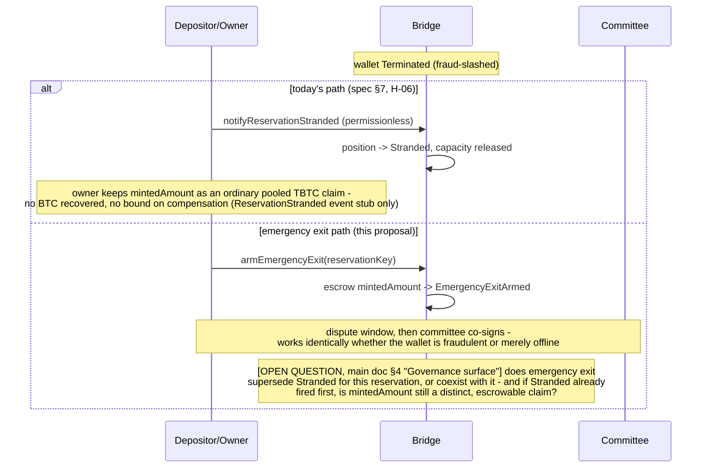
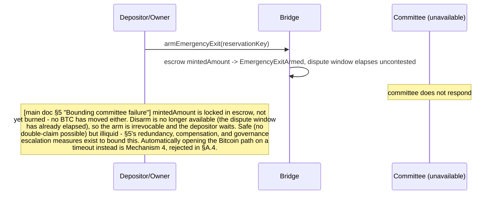

# Reservation Emergency Exit — Addendum

Status: part of the retained design reference, deferred. Per the Decision in `README.md`
(2026-08-21), no emergency-exit mechanism is built and `Stranded` remains the fallback; this
document keeps the rejected-mechanism history so read it as reference, not an active plan.

Companion to `proposal.md` — read that first. This keeps
what got cut from the main document for concision: the revision history, the three rejected
mechanisms (kept so they don't get re-proposed without this analysis attached), the full
comparison table, and secondary edge-case flows.

---

## A. Rejected mechanisms

### A.1 Revision history

The first draft proposed embedding a depositor-controlled CLTV refund branch directly in the
anchor output, refreshed on every anchor-creating action, and claimed early exercise "only
unlocks after a genuine, sustained liveness failure." Three flaws surfaced across two review
passes:

1. **The refresh claim was false for the common case.** `extendCustody`/`extendReservation`
   (spec `§5`) is Ethereum-only — no Bitcoin action, no new anchor. A long-held reservation's
   expected lifecycle is accept-once, renew-repeatedly, with zero re-anchors. A locktime baked
   in once at acceptance is fixed and finite; it *will* lapse during a fully healthy,
   cooperating wallet's normal multi-year custody. That's a straightforward unilateral-exit
   vulnerability against a healthy wallet, not a liveness safety valve.
2. **The exit didn't burn the TBTC claim.** The Bitcoin-side spend is out-of-band from the
   Bridge — no proof submission, nothing for the contract to observe. Grabbing the BTC
   unilaterally while `mintedAmount` stays outstanding and transferable doesn't compensate a
   shortfall, it manufactures one, borne by every other TBTC holder. Worse than today's
   `Stranded` fallback (spec `§7`, H-06), which at least leaves a claim against remaining backing
   rather than a claim against backing that's now provably gone.
3. **The "fix" for #2 — burn-after-the-fact via a permissionless SPV proof — still doesn't
   close the hole.** `mintedAmount` mints as an ordinary, freely transferable ERC-20 (spec `§7`
   "owner keeps minted TBTC as an ordinary pooled claim"; spec `§6` dissolution leaves "owner's
   claim ... outstanding as ordinary TBTC" — the Bridge holds no lien on it by default). A
   depositor can accept a reservation, immediately sell the minted TBTC, wait out the CLTV doing
   nothing, then exercise the refund branch: the later permissionless proof arrives at an empty
   balance with nothing left to burn, and the shortfall lands on whoever bought the TBTC. Not a
   corner case — a strictly profitable attack available to every reservation owner, and it also
   breaks **R4**: early exercise against a healthy wallet stops being self-defeating the instant
   the TBTC is sold — it becomes free.

### A.2 Mechanism 2 — Ethereum-execution-derived hash-lock

Idea: embed `SHA256(x)` in the anchor's refund branch, where `x` is a value the Bridge contract
"assigns" during execution of a burn call — something the depositor supposedly cannot know
before that transaction runs, closing the classic HTLC bypass (a depositor who already holds a
secret can just reveal it directly on Bitcoin, skipping Ethereum entirely).

**Does not work.** Ethereum contract storage has no private state. Anything the contract
"computes during execution" — a monotonic counter, a hash of `(reservationKey, blockNumber)`,
whatever — is either a pure function of already-public inputs (the depositor can compute it
themselves in advance, defeating the ordering requirement) or depends on genuinely unpredictable
external entropy (a VRF/randomness beacon), which just relocates the trust dependency onto that
oracle. There is no way to make a value simultaneously (a) knowable to the depositor only after
their own on-chain call executes, and (b) not already computable by them in advance, using
nothing but Ethereum's own fully transparent state. A genuinely trustless "gate the Bitcoin
spend on an Ethereum event" without a witness does not exist in this design space.

**Verdict**: does not satisfy R2 as conceived.

### A.3 Mechanism 3 — self-settling permissionless proof (static CLTV)

Idea: invert the ordering instead of trying to gate it. Reuse tBTC v2's normal pattern of
having Ethereum *observe* Bitcoin, permissionlessly, via SPV proof (spec `§4` — every existing
action settles this way). A static two-path anchor script (cooperative wallet path + a
depositor-refund path gated by a fixed CLTV); the depositor exercises the refund branch
whenever the CLTV allows, with zero Ethereum interaction; a new permissionless
`submitReservationEmergencyExitProof` function burns `mintedAmount` after the fact once anyone
proves the spend happened. The safety argument was economic: early exercise against a healthy
wallet was supposed to be self-defeating (same net position as normal redemption, but slower
and costlier), so a static, never-refreshed locktime was supposed to be safe.

**That argument only holds if the depositor still holds the TBTC at exercise time, and nothing
guarantees that** (revision-history item 3 above). Adding an "arm first, escrow the claim" step
does not fix this: escrowing `mintedAmount` at an explicit arming call makes the *armed* path
safe, but the raw Bitcoin CLTV branch is still, unavoidably, spendable on its own, because
**Bitcoin Script cannot verify that an Ethereum arming call ever happened.** A depositor who
skips arming entirely and just waits for the static CLTV to lapse hits the exact same exploit —
arming becomes an optional path alongside a still-open unsafe one, not a replacement for it. Any
mechanism that requires no live cooperation at exercise time is, by construction, also usable by
anyone who satisfies its purely time-based condition regardless of what did or didn't happen on
Ethereum in the meantime. Same limitation as A.2, applied to the escrow precondition instead of
the hash-lock.

**Verdict**: cannot satisfy R2/R4 as a self-contained, no-live-party mechanism, with or without
an arming/escrow refinement. The only way to close the gap is a live check at exercise time —
the mechanism actually adopted in the main proposal.

### A.4 Mechanism 4 — inverted liveness (heartbeat-suppressed exit)

Idea: flip the liveness assumption instead of satisfying it. Rather than the exit requiring a
live committee to *authorize* it, make the exit available by default and have evidence of
liveness *suppress* it. A heartbeat — from the committee, the wallet, or the network — pushes an
exit deadline forward; if the heartbeat stops, the depositor's exit path opens on its own. A
dead-man's switch.

This is the most attractive of the rejected ideas, and it genuinely answers the flaw that killed
the first draft. `§A.1` flaw 1 was that a locktime baked in once at acceptance goes stale during
healthy custody, because renewal never touches Bitcoin. A heartbeat that actually moves the
locktime forward fixes exactly that. It fails for two other reasons.

**1. It converts a liveness failure into a safety failure.** This is where R5 came from.
Default-deny fails closed: the committee dies, no exit is authorized, the position is illiquid
and nothing is lost. Default-allow fails open: whatever suppresses the heartbeat opens the exit
path *while the wallet is still healthy and still holding the BTC*. That isn't an inconvenience,
it's a depositor draining a live, cooperating wallet.

The suppression doesn't need an attacker. A Bitcoin fee spike, mempool congestion, relay-level
censorship, an operator outage, a reorg, or a plain bug all produce it, and those are normal
recurring events. It also inverts the value of attacking the mechanism: under the adopted design,
DoSing the committee produces illiquidity and nothing more, so it's a nuisance; here it produces
unauthorized exit eligibility across many positions at once, so heartbeat suppression becomes a
genuinely valuable target.

**2. Every way of producing the heartbeat fails.** The heartbeat has to move something
Bitcoin-side or Bitcoin can't see it (the standing constraint). On an anchor output, "move
something Bitcoin-side" means spending and recreating it — a re-anchor. So the question is who
signs:

| Heartbeat signer | Result |
|---|---|
| **Wallet, on Bitcoin** | The strongest version, and it needs no committee at all, so no new trusted actor. But R2 is unenforceable: when the wallet genuinely dies, the depositor can sell the TBTC *and* take the BTC (`§A.1` flaw 2, unchanged). Worse, it pays reservation owners for wallet failure, so owners now want it to happen. Also forces a periodic on-chain re-anchor per reservation forever, turning the spec's unresolved re-anchor fee-grinding surface (spec `§16`) into normal operation. |
| **Committee, on Ethereum** | Doesn't work at all. An Ethereum attestation cannot suppress a Bitcoin timelock. Collapses directly into `§A.3`. |
| **Committee, on Bitcoin** | Either the heartbeat needs the depositor's co-signature, in which case the depositor simply refuses and the deadline lapses on demand (free exit, R2 and R4 both gone), or the committee can move the anchor alone, which promotes it from co-signer to unilateral custodian able to steal the BTC outright. |

**Verdict**: rejected. Breaks R5 in every form, and R2 in the only form that is otherwise
coherent. The defect it targets is real — `§B.2`'s unbounded illiquidity — and main doc `§5`
addresses that without inverting the direction of failure.

**Scope note worth recording.** "Let the depositor exit when the network is down" is not
achievable by any design, not just this one. If Ethereum is unavailable the escrow can't be taken
and the burn can't happen, so any exit that works under those conditions is necessarily unburned.
R2 is unsatisfiable by construction there, which is why the mechanism's honest scope is committee
or wallet failure only (main doc `§2`).

### A.5 Comparison

| | Escrow-gated attestor (adopted) | ETH-derived hash-lock | Self-settling proof (static CLTV) | Inverted liveness (heartbeat) |
|---|---|---|---|---|
| R1 (no refresh dependency) | Yes | Yes, in principle | Yes | No — a heartbeat *is* a refresh dependency, by design |
| R2 (burn enforced) | Partly — escrow-before-authorization closes it unconditionally against a depositor acting alone, but not against committee collusion, which runs through the disarm refund (main doc §3, §4) | No — doesn't work on transparent-state Ethereum | No — raw CLTV branch bypasses any arming step; sell-then-wait is profitable | No — same out-of-band Bitcoin exit; sell-then-exit survives, and wallet failure becomes profitable |
| R3 (no dependency on failed component) | Yes, if committee is a distinct liveness domain | N/A (already broken) | Yes on its own terms, but irrelevant — R2/R4 already broken | Yes, in the wallet-signed variant — the one place this design wins |
| R4 (last resort, not shortcut) | Partly — holds against a depositor acting alone; collusion removes both the wait and the cost (main doc §3, §4) | N/A (already broken) | No — early exercise is free once TBTC is sold | No — free once TBTC is sold, or on demand if the depositor can withhold heartbeats |
| R5 (fail closed) | Partly — holds for committee unavailability (crash faults), not for committee misbehaviour (byzantine faults) | N/A (already broken) | No — a lapsed timelock is an open exit with nothing gating it | No — this is the defining flaw; any hiccup opens the exit against a healthy wallet |
| New trusted actor | Yes — ongoing key-mgmt/uptime burden | N/A | No | No, in the wallet-signed variant |
| New cryptography | No | Yes, and it doesn't close | No | No |
| Reuses existing audited patterns | Yes — escrow mirrors normal redemption's request-time escrow | No | Yes — same SPV-proof shape as every other action, but doesn't help; the flaw is upstream of the proof step | Partly — re-anchor machinery exists, but forcing it on a schedule is new operational surface |

Two standing lessons come out of these four attempts, and both are properties of the design
space rather than puzzles to re-attempt per mechanism:

1. **Bitcoin Script cannot verify Ethereum state.** The "no live party" property that made the
   static-CLTV design look attractive is exactly what makes it impossible to close against the
   sell-then-wait attack. Any variant that avoids a live actor at exercise time hits this, as
   `A.2` and `A.3` both did. A live check at exercise time is not an implementation detail of the
   adopted design, it is the only known way to close R2 at all.
2. **The exit must fail closed (R5).** `A.4` satisfies lesson 1 and still fails, for an
   independent reason: it makes the exit the default and liveness the suppressor, so its own
   operational hiccups authorize withdrawals that should never have been authorized. Any future
   proposal that opens the Bitcoin path on a timer, a timeout, or an absence of evidence
   inherits this, regardless of how the timer is refreshed.

---

## B. Secondary edge-case flows

### B.1 Wallet fraud-slashed and Terminated — vs. today's `Stranded` path



### B.2 Committee fails to co-sign (unavailable)



### B.3 Wallet recovers after arming — disarm within the window

```mermaid
sequenceDiagram
    participant D as Depositor/Owner
    participant W as Wallet (recovers)
    participant B as Bridge
    participant C as Committee

    D->>B: armEmergencyExit(reservationKey)
    B->>B: escrow mintedAmount -> EmergencyExitArmed
    Note over W: wallet comes back online during the dispute window
    D->>B: disarmEmergencyExit(reservationKey)
    Note over B: still inside the dispute window - succeeds
    B->>B: refund escrowed mintedAmount -> Active
    Note over D,C: committee never had a chance to sign - nothing to revoke,<br/>no double-claim possible. Disarm reverts if attempted after the window elapses<br/>(main doc §3) - by then the committee's protocol may already have a valid<br/>co-signature, which no Ethereum-side refund could unwind.
    Note over B: this immediate refund is what committee collusion targets (main doc §4);<br/>the proposed fix releases it only on SPV proof that the wallet re-anchored,<br/>which invalidates any early co-signature outright. A refund delay does not work -<br/>a signature has no expiry, so the attacker just waits it out.
    D->>B: requestReservedRedemption (normal path, now that the wallet is back)
    W->>B: settles normally
```

Two edge cases from an earlier revision — concurrent partial redemption racing an arm attempt,
and double-arming — are **not** carried forward here: both are already resolved by the main
proposal's `§3` precondition that `armEmergencyExit` is only valid while the reservation is
`Active`. A `Pending` generation (partial redemption or otherwise) or an existing
`EmergencyExitArmed` state each already blocks a concurrent arm attempt outright, the same way
every other request-type call in the two-phase model blocks concurrent generations. No open
question remains there.
