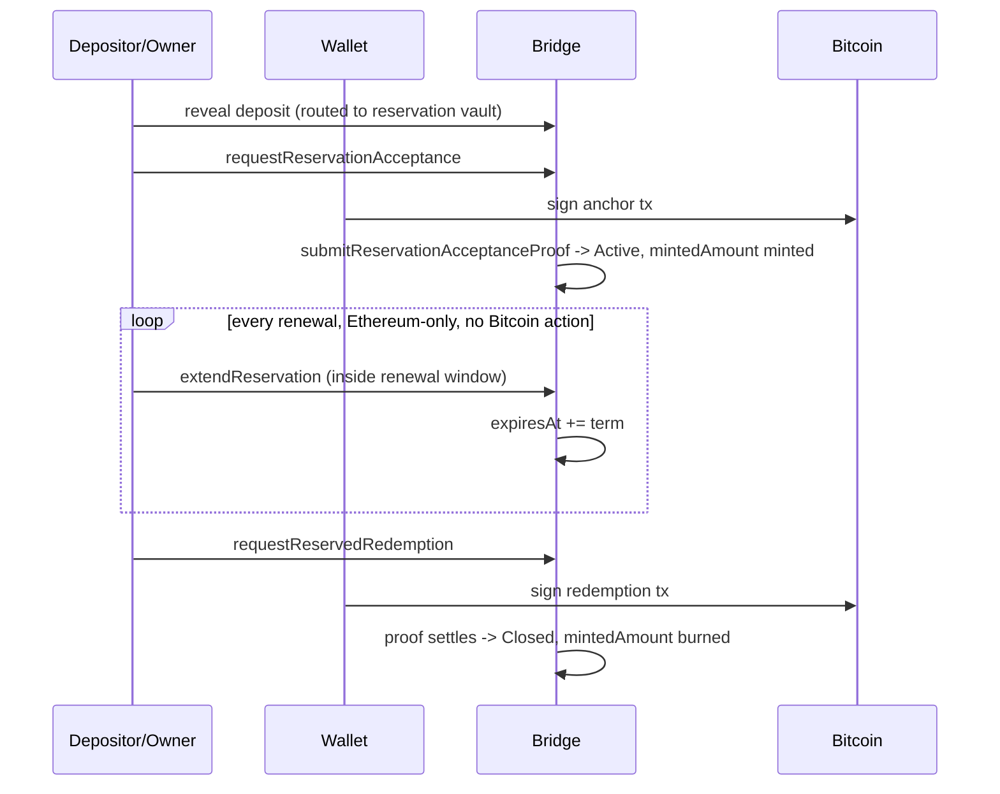
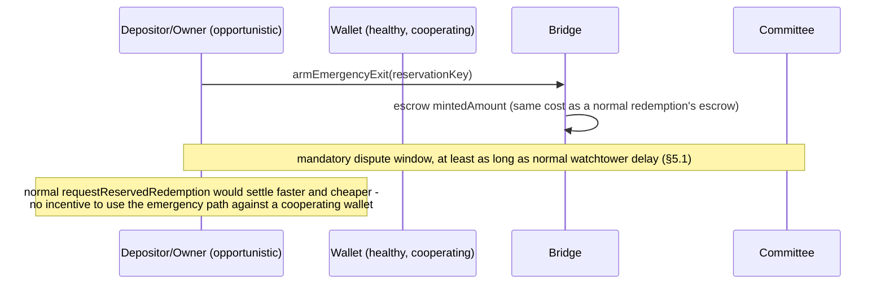

# Reservation Emergency Exit — Off-Ramp Proposal

Status: DESIGN REFERENCE, deferred - Mechanism 1 is not built. Per the Decision in `README.md`
(2026-08-21), `Stranded` remains the fallback and this document is retained as the mechanism spec
to rebuild from if evidence ever reopens the question. Rejected
alternatives, revision history, the full mechanism comparison, and secondary edge-case flows
live in `addendum.md` — this document keeps only the
mechanism that actually works. Companion to `../feature-spec.md`.

Alternative designs live in `alternatives.md`, along with a
closure argument showing why a live party at exercise time is forced rather than chosen. Read it
before proposing a fifth mechanism family: it records which directions are provably dead and why.

Two findings there bear directly on this document. First, it identifies **two unwritten
requirements** — that the emergency path be able to consult current compliance state (the
redemption watchtower) and, more generally, any Ethereum state that changed after anchor creation,
including the position's own renewed lifetime. Those, not R2, are the strongest justification this
mechanism has, and no timelock-based design can satisfy either. Second, it settles the *shape* of
the live party. Because any key an anchor script checks is fixed when the anchor is created, a
threshold group with share refresh is the only construction that survives multi-year custody: a
plain multisig cannot change membership without changing the script, and a single fixed signer
cannot be replaced at all.

An earlier draft of this note recommended evaluating a reactively-chosen single bonded co-signer
(Mechanism 6) before building this mechanism. **That is withdrawn** - reactive selection is not
expressible for exactly the reason above, and `alternatives.md` §7 records why both substitutes are
worse than what they replace. What remains open is staffing, not shape, and `§5.1` gives the
cheapest answer: Council-appointed membership of a distinct threshold group.

## 1. Problem

Today, if a reservation's wallet stops cooperating — offline, or fraud-slashed and
`Terminated` — the depositor has no way to recover their specific BTC. Best case is the
existing `Stranded` fallback (spec `§7`, H-06): the owner keeps `mintedAmount` as an ordinary,
socialized TBTC claim, with no bound on how long that takes and no built compensation mechanism
(`ReservationStranded` is an event stub only). Reservations' segregated, 1-to-1, unbroken-lineage
custody is what makes a real fix uniquely tractable here — a pooled wallet's main UTXO backs many
depositors' fractional claims at once, so there's no way to carve out "this depositor's share"
the way there is for a reservation's single anchor.

Per the Decision in `README.md` (2026-08-21), this `Stranded` outcome is the **accepted** answer
for now: it is free, already built, safe, and socialized, and the cost of the below mechanism is
not yet justified by evidence. This section frames what a build would solve *if the decision
flips*; it is not the active plan.

## 2. What this has to satisfy

**In one sentence:** a depositor whose wallet has stopped cooperating should be able to recover
their specific BTC, without that path ever becoming a way to take BTC away from a wallet that is
still working, and without leaving TBTC outstanding that nothing backs any more.

Five requirements follow from that sentence. R1 through R4 were derived up front; R5 came out of
the review that rejected Mechanism 4 (addendum `§A.4`), and is the single reason that whole
family of designs fails.

| | Requirement | Plainly | If dropped |
|---|---|---|---|
| **R1** | No periodic refresh dependency | The mechanism can't need something re-done on Bitcoin every so often to stay correct | Renewal is Ethereum-only (spec `§5`), so anything baked into Bitcoin at acceptance goes stale during perfectly healthy custody |
| **R2** | Burn is enforced, not encouraged | Taking the BTC out must destroy the TBTC claim, whether or not the depositor cooperates | The depositor sells the TBTC and also takes the BTC; the shortfall lands on the buyer and the pool |
| **R3** | No dependency on the failed component | Exit must not need a new signature from the possibly-dead wallet quorum | The mechanism is unusable in exactly the situation it exists for |
| **R4** | Last resort, not a shortcut | Must be strictly worse than normal redemption while the wallet is healthy | It becomes the default exit path and every reservation routes around normal redemption |
| **R5** | Fail closed, not open | If the mechanism's own machinery breaks, the result must be an exit that doesn't work, never one that shouldn't have | A failure in the safety valve becomes a theft from a live wallet instead of an inconvenience |

Two of these carry caveats worth stating here rather than leaving buried in `§3`:

- **R2 is only partially achievable, and that's structural.** There is no way to put an
  Ethereum-state precondition on a Bitcoin spend (see the standing constraint below). What
  Mechanism 1 guarantees unconditionally is narrower: a depositor who never held the
  escrowed claim cannot get an exit armed at all, so the sell-then-exit attack is impossible
  regardless of anyone's behavior. The rest of R2 rests on committee policy, the same trust
  assumption R3 already carries.
- **R5 says which direction to fail, not how far.** Mechanism 1 fails closed, but its
  current failure mode is *unbounded* illiquidity (addendum `§B.2`), which is safe and still not
  acceptable as a resting place. `§5` bounds it.

**Threat model: which "outage" is in scope.** Ethereum and Bitcoin are assumed to stay live.
They may reorg, congest, or spike in fee, but they do not stop, and if they hiccup they resume
quickly. The outage this mechanism exists for is a **Threshold network outage**: keep-core
operators going dark, so the wallet's signing quorum cannot produce a Bitcoin signature.

That assumption is load-bearing and it works in the design's favour. Because Ethereum keeps
running even when every operator is offline, the escrow can always be taken, the burn can always
be executed, and every permissionless timeout notification still lands (`§6.1`). So R2 is
achievable here, unlike under a hypothetical Ethereum outage where it would be unsatisfiable by
construction. The missing capability during a Threshold outage is narrowly Bitcoin signing, which
is exactly what an independent co-signer supplies.

**Two standing constraints.** Four mechanism families have been tried (addendum `§A`), and they
failed against two distinct walls. Both are properties of the design space, not puzzles to
re-attempt per mechanism:

1. **Bitcoin Script cannot verify Ethereum state.** Anything that needs no live party at
   exercise time is, by construction, also usable by someone who never did whatever the mechanism
   meant to require of them first. A hash-lock keyed to Ethereum execution data fails here
   because Ethereum has no private state; a self-settling static timelock fails here because
   `mintedAmount` is a freely transferable ERC-20, so a depositor can sell it, wait, and exit for
   free. A live check at exercise time is the only known way to close R2 at all.
2. **The exit has to fail closed (R5).** An inverted design — exit open by default, suppressed
   by evidence of liveness — clears the first wall and still fails, because its own operational
   hiccups authorize withdrawals that should never have been authorized. Any proposal that opens
   the Bitcoin path on a timer, a timeout, or an absence of evidence inherits this, however the
   timer gets refreshed.

## 3. The mechanism: escrow-gated attestor/co-signer

A small, purpose-built standing **committee** — cryptographically independent Bitcoin signing
key material, structurally separate from the wallet's own signing quorum — is added as an
alternate spending path on the reservation's anchor output.

**Anchor script**, embedded at every anchor-creating action (acceptance, re-anchor,
partial-redemption remainder):

```
IF
  <wallet pubkey> CHECKSIG                                                -- cooperative, as today
ELSE
  <committee pubkey> CHECKSIGVERIFY <depositor refund pubkey> CHECKSIG    -- emergency path
ENDIF
```

No timelock. The gate is the committee's own live policy check, not a blockchain-enforced time
value — that's the property a static script can never have (addendum `§A`).

**Flow:**
1. `armEmergencyExit(reservationKey)` — an Ethereum call, valid only while the reservation is
   `Active` (blocks cleanly if another generation is already `Pending`, mirroring every other
   request-type call in the two-phase model, spec `§4`). **Escrows** (locks into contract
   custody, not yet burned) `mintedAmount` from the owner's current balance, exactly like a
   normal redemption request already does — reverts if they don't hold it. Position moves to a
   new `EmergencyExitArmed` state.
2. **Dispute window.** While it's running, the owner may call `disarmEmergencyExit` to cancel:
   refunds the escrowed claim, returns the position to `Active`. Once the window elapses,
   `disarmEmergencyExit` reverts — the arm becomes irrevocable from that point on. **The refund
   is the mechanism's one remaining soft spot**: it is the only thing that makes committee
   collusion profitable, and it needs the hardening in `§4` before this is buildable.
3. Once the window has elapsed uncontested, the committee — whose own protocol commits it to
   never construct or release a co-signature before the window has definitively closed —
   verifies the escrow is still locked and live, then co-signs the emergency-path spend with
   the depositor's own key, to the depositor's refund address. The depositor broadcasts.
4. Once the spend confirms, anyone submits a permissionless SPV proof of it (same shape as
   every other settlement proof in this system, spec `§4`) — the Bridge **burns the escrowed
   claim** and the position moves to `Closed`.

**Why the disarm boundary has to be the dispute window, not "before a completion proof
lands."** A committee-released Bitcoin signature is a bearer instrument with no expiry: once
produced, the depositor can broadcast it whenever they choose, and Bitcoin has no way to observe
that a later Ethereum-side refund happened. Cancelling *after* the committee has signed would
let a depositor disarm (refund the escrow) and still hold — and later exercise — the co-signed
spend, recovering both the BTC and the TBTC: the exact double-claim this mechanism exists to
prevent. Bounding disarm strictly to the dispute window turns an otherwise-unobservable question
("has the committee signed yet?") into a plain `block.timestamp` check any contract can enforce
— but it only works because the committee's protocol carries a stated requirement to never sign
early, not a convenience.

This looks superficially like the rejected static-timelock design's after-the-fact burn
(addendum `§A.3`), but the critical difference is ordering: there, nothing was locked before the
Bitcoin spend, so a depositor could sell the TBTC first and the later proof found nothing to
burn. Here, the claim is already locked in contract custody at step 1, before the committee will
even consider co-signing — there is no window where the depositor simultaneously holds
transferable TBTC and an exercisable Bitcoin path. The proof step in step 4 is a bookkeeping
formality that graduates an already-guaranteed escrow to a burn; it carries none of Mechanism
3's risk.

**Why it closes R1-R5:**
- **R1**: no anchor-embedded *timelock* — arming is a fresh Ethereum call, independent of anchor
  age. The committee's pubkey embedded in the script should be a stable, rarely-rotated
  reference (governance-gated, like `MaintainerProxyV2`), not something tied to the renewal
  cadence. Committee rotation still has a real, separate cost — flagged in `§4` below.
- **R2**: enforced by escrow-before-authorization, not by an on-chain precondition on the
  Bitcoin spend itself — there isn't one; the committee's key is cryptographically capable of
  signing regardless of Ethereum state. Soundness rests on the committee actually checking the
  escrow before co-signing — exactly the same trust assumption R3 already depends on. Scope the
  guarantee precisely:
  - **Against a depositor acting alone, with an honest committee: unconditional.** Arming
    reverts unless the depositor holds `mintedAmount`, so the sell-then-exit attack that broke
    `§A.3` is impossible. Whatever else happens, the claim was locked before any authorization
    existed.
  - **Against a committee colluding with the depositor: not closed**, and the exploit runs
    through the refund, not the signature. See `§4`. Note the shape of it: collusion on the
    *signature* alone gains nothing — the depositor pays `mintedAmount` and receives their BTC,
    which is just a normal exit. It only becomes theft if the escrow is also refunded.
- **R3**: satisfied if the committee is a genuinely distinct liveness domain from the wallet
  quorum (different operators, different infrastructure) — the entire point of not needing the
  failed component to cooperate at exit time.
- **R4**: holds against a depositor acting alone. Exercising it costs the same `mintedAmount` a
  normal redemption would, plus the dispute-window wait, so it is never free and never faster.
  **Does not hold against collusion**: an early signature removes the wait, and the `§4` refund
  exploit removes the cost, at which point it is both cheaper and faster than normal redemption.
- **R5**: holds for committee *unavailability* (crash faults) and not for committee
  *misbehaviour* (byzantine faults). A committee that goes dark authorizes nothing and the
  position is merely illiquid, which is the correct direction and is what `§5` bounds. A
  committee that signs when it shouldn't fails open, which is the whole of `§4`.

**One root cause behind all three caveats.** R2, R4, and R5 are each unconditional against a
depositor acting alone and each conditional on committee honesty, for the same structural reason:
the anchor's emergency branch carries **no Ethereum precondition**. Bitcoin cannot check the
escrow, so the committee's key is cryptographically capable of authorizing a spend at any moment,
whatever the contract state says. Everything the escrow buys is *upstream* of that signature, not
a constraint on it. Read the three as one assumption, not three independent guarantees, and treat
"the committee follows its policy" as the mechanism's single load-bearing trust premise.

## 4. Open questions

- **Committee composition and selection.** Who sits on it, how are they chosen/rotated, what's
  their own signing threshold, and what makes their liveness genuinely independent from the
  wallet quorum's rather than nominally-separate but practically-correlated?
- **Committee key rotation and anchor staleness — largely resolved, see `§5.1`.** An anchor
  created years ago embeds *that era's* committee key, and if the wallet is also unavailable it
  can't re-anchor to refresh the reference. A threshold group with share resharing keeps the
  *group* public key constant across membership changes, so rotation stops invalidating old
  anchors. What remains is the operational question of running resharing ceremonies reliably over
  a multi-year horizon, not a design hole.
- **The disarm refund is the one profitable target for a dishonest committee, and it needs a
  structural fix.** Concretely: depositor arms (escrow taken), a colluding or key-compromised
  committee co-signs immediately in violation of its own no-early-signing policy, the depositor
  calls `disarmEmergencyExit` while still inside the window (refund issued, position back to
  `Active`), and *then* broadcasts the early signature. Result: the depositor holds both the
  refunded, transferable `mintedAmount` and the BTC, with the anchor spent and the position
  reading `Active`. That is a "nothing left to burn" outcome, so R2 does not hold against
  collusion as currently drafted.

  **Why a delay does not fix this.** The obvious patch is to make the refund two-phase like
  settlement: record intent, wait, and let anyone submit a permissionless SPV proof that the
  anchor was spent to cancel the refund and burn instead. That fails for the reason already
  established above — a co-signature has no expiry. The attacker simply waits: arm, get the early
  signature, disarm, sit out the refund delay, collect the refund, *then* broadcast. The
  spend-proof arrives after the escrow is gone. Any fixed delay is beaten by waiting, so a delay
  raises the cost and makes the attack loud without closing it.

  **The fix has to invalidate the signature rather than race it.** Release the refund only on an
  SPV proof that the wallet has *re-anchored* — spent the old anchor outpoint into a new one. A
  Bitcoin signature commits to the specific input it spends, so once that outpoint is consumed,
  the committee's early signature is permanently unbroadcastable rather than merely late. This
  holds even if the depositor, committee, *and* wallet all collude: the wallet must actually
  spend the UTXO to unlock the refund, and that act is what kills the signature. The two outcomes
  are mutually exclusive by construction, not by timing.

  It also matches what disarm is *for*. Disarm means "the wallet turned out to be alive after
  all," and a wallet that re-anchors on request is exactly the proof of that. Residual details,
  none of them blocking: disarm stops being a unilateral depositor action, though the depositor
  loses nothing by attempting it (if the re-anchor proof never arrives the position simply stays
  `EmergencyExitArmed` and the exit path stays open, so a wallet that refuses to re-anchor only
  pushes the depositor back to exiting); the disarm re-anchor costs a Bitcoin fee that needs
  attribution under `§6`'s in-kind fee model; and the proof needs enough confirmation depth that
  a reorg cannot un-spend the anchor after the refund has been paid, which is the same concern as
  the escrow-finality question below.
- **Remaining dishonest-committee exposure after that fix.** A committee can still refuse to
  sign (censorship, covered by `§5`) or sign a spend to the wrong address — the latter needs its
  own look, since the depositor's mandatory co-signature limits but does not obviously eliminate
  it.
- **Escrow finality depth.** The committee reads Ethereum state directly (no cryptographic proof
  needed — the whole point of on-chain escrow over a hash-lock) — does it need extra
  confirmation depth, or does the dispute window already provide enough of a reorg buffer?
- **Governance surface.** New parameters (dispute-window length, committee membership), new
  states/events, and the relationship to the existing `Stranded` compensation stub (spec `§7`,
  `§15`, `§16`) — does this replace it or coexist as a depositor-triggered alternative?

## 5. Bounding committee failure

`§4` asks what happens when the committee is unavailable, and addendum `§B.2` traces where that
lands today: the position is safe but stuck, with no bound and no escalation. That is the right
*direction* of failure (R5) and the wrong place to stop. Three measures, cheapest first:

1. **Redundancy instead of a fallback, built as a threshold group.** The real defect isn't a
   missing timeout, it's a single liveness dependency. See `§5.1` for why this must be a
   threshold scheme rather than a shared key, and for what it buys.
2. **Compensation, reusing a module the spec already owes.** `ReservationStranded` (spec `§7`,
   `§15`, `§16`) is an event stub today with no compensation mechanism behind it. That same
   module, once built, bounds this case too: a position stuck by committee failure accrues a
   priced claim instead of waiting indefinitely. One missing module covers both the
   wallet-failure hole and the committee-failure hole.
3. **Governance escalation, kept on Ethereum.** A committee unresponsive past some bound makes
   the position eligible for a governance-authorized resolution: rotate the committee, authorize
   a one-off exit, or trigger compensation. Slow and centralized, but the decision stays where
   state is observable and the default stays deny.
4. **A terminal disposition, and it is load-bearing rather than a loose end.** With `§6.2` scoped
   correctly the wallet closes and the caps are freed, but the escrowed claim itself is still
   locked with no endpoint. Two resolutions were listed here as equivalent options; they are not.
   *Force-refund once the anchor is provably unspendable* cannot be reached in the case that
   matters: proving the old committee signature is dead requires the anchor to have been
   re-anchored, and a dead wallet cannot re-anchor. So the only reachable terminal disposition is
   **governance force-burns the escrowed claim and pays compensation**, which makes item 2 a
   prerequisite for this item rather than an alternative to it.

   This also closes a strictly-negative failure mode. Post-window, `disarmEmergencyExit` is
   unavailable by design, so a depositor who arms against a committee that never acts has
   destroyed their claim's liquidity and received nothing - worse than today's `Stranded`, where
   the TBTC at least stays transferable. Arming must not be a one-way trip into a state with no
   exit.

What this deliberately does **not** do is open the Bitcoin exit path automatically on a timer, or
on the absence of a heartbeat. That is Mechanism 4, rejected in addendum `§A.4` for breaking R5
and R2 at once.

### 5.1 Committee construction: threshold signing, not a shared key

The obvious way to make the committee more available is to hand its private key to several
operators who each run committee software. **That is strictly worse than a single well-run
signer.** If every holder has a full copy of the key, any *one* of them can co-sign alone, so the
trust assumption degrades from "the committee is honest" to "all N holders are honest, forever."
That is 1-of-N safety with N-fold attack surface, and it points at exactly the wrong risk: the
one thing that actually breaks R2 is a committee signing early (`§4`), so multiplying the number
of parties who can do that unilaterally is the worst available direction.

The right shape is a **threshold signature, t-of-n, where no party ever holds the full key**.
Liveness survives `n - t` failures; safety requires `t` colluders rather than one. Both sides
improve at once, which is the whole point.

This is not new cryptography for this project. tBTC already runs threshold ECDSA (GG20) for every
wallet today, and the FROST/ROAST BIP-340 migration is already in flight (spec `§17`). The
committee is a much smaller and simpler instance of machinery the protocol already operates.

Four consequences worth stating:

- **Resharing fixes anchor staleness, and replaces it with a continuity obligation.** Threshold
  schemes support share refresh and membership change while keeping the group public key constant.
  Since anchors embed the committee key, a constant group key means operator *rotation* never
  invalidates a live anchor, which is what `§4`'s staleness question was actually about.

  What it does not do is make the key immortal, and that distinction is the whole cost. The
  guarantee holds only while the group keeps existing and keeps refreshing. Precisely: missing one
  ceremony is not a cliff, because the previous share set stays valid against an unchanged group
  key; the failure is *cumulative attrition* below `t`, and dissolution is immediate death. Since
  the custody term has no maximum (`alternatives.md` `§3.1` - the only ceiling is the
  incidental `uint32` rollover in 2106), an anchor minted in 2027 can outlive several generations
  of committee. If the group ever falls below `t` without resharing, every live anchor's emergency
  branch becomes permanently unexercisable: the case-3 dead-key failure this mechanism exists to
  prevent, now caused by the mechanism.

  **So the mechanism does not eliminate dead-key risk, it relocates it** - from a wallet quorum
  whose lifetime is tied to the position, to a committee that must outlive it. That is the same
  soft-permanent wall the BitVM analysis reached: trust gets relocated, never removed.

  Two consequences. Item 4's terminal disposition is what backstops this, which is the second
  reason it is load-bearing. And **a bounded maximum custody term stops being only Mechanism 5's
  cost and becomes something Mechanism 1 needs too**: it is the only thing that converts an
  unbounded key-liveness obligation into a finite one. The alternatives doc prices an unbounded
  term as an argument *against* the lien; it is equally an argument for capping the term whichever
  mechanism ships.
- **Bias `t` high.** The failure modes are asymmetric: a committee that refuses to sign causes
  illiquidity, which `§5` bounds and which is recoverable; a committee that signs when it
  shouldn't causes an unrecoverable loss of backing. Tune for the second, accept slower liveness,
  and let redundancy of `n` rather than a low `t` carry availability.
- **The tradeoff that matters isn't cryptographic, it's staffing.** A threshold group drawn from
  the same operators, on the same infrastructure, as the wallet signing quorum satisfies R3 only
  nominally: whatever killed the quorum probably kills the committee too. Distinct operators and
  distinct infrastructure is the requirement, and it's the unresolved part of `§4`'s first
  question. The cryptography is the easy half.
- **Membership should be governance-gated, and governance should not be the committee.** The
  Threshold Council Safe is the natural staffing answer and a good one: it adds no marginal trust
  in the safety direction, since a body that can upgrade the Bridge implementation can already do
  worse than co-sign one exit; it satisfies R6 by construction, being the body that decides
  compliance posture; and it is genuinely distinct from the wallet operators, which is more than
  default staffing achieves against R3.

  But the Council cannot *be* the committee. A Gnosis Safe holds no private key - its `m`-of-`n`
  is enforced by Ethereum contract logic, which Bitcoin Script cannot evaluate - so "the Council"
  in an anchor script can only mean a separate Bitcoin key held by the same people, inheriting
  none of the Safe's membership or rotation. And a plain `m`-of-`n` of Council signers is *worse*
  on staleness than a threshold group, because changing the signer set changes the script. Council
  owner rotation is routine: `tbtc-v2/solidity/deploy/42_deploy_timelock.ts:15-17` already lists
  the Safe as its own executor specifically because rotation-versus-registry drift is expected to
  be forgotten. That drift is one transaction to repair in an Ethereum registry and unrepairable
  in an anchor script.

  Decisively, merging the two roles burns item 3. Governance escalation is the named backstop for
  committee unavailability; if the Council *is* the committee, a committee outage is a governance
  outage and there is no higher body. **The recommendation is Council-appointed membership of a
  distinct threshold group**: the Council authorizes and rotates it and retains escalation and
  compensation authority, while its own keys never appear in an anchor script.

**Honest cost: this is threshold signing stacked on threshold signing.** The objection is real
and worth stating in the doc rather than leaving for review. tBTC's whole trust model is already
a threshold signing group; this adds a second, independent one, with its own DKG, share custody,
resharing ceremonies, liveness monitoring, membership governance, and operator onboarding — and
per R3 it deliberately cannot reuse the existing operators or infrastructure, or it isn't a
distinct failure domain. So "tBTC already does threshold signing" is a weaker argument than it
sounds: reusing a *technique* is not reusing an *instance*. This also lands while the FROST/ROAST
migration of the existing wallets is still in flight, which is already a large multi-quarter
program.

Weigh that against what it competes with. The status quo is `Stranded`: a socialized loss and an
event stub, with zero new machinery. The obvious cheaper alternative is the compensation module
the spec already owes (`§7`, `§15`, `§16`), sketched in
`../stranding-compensation-proposal.md`.

**That sketch does not support treating compensation as a substitute for this proposal, and an
earlier draft of this section wrongly implied it did.** Working the numbers showed the two address
different harms:

- On stranding the depositor keeps `mintedAmount` in *fungible* TBTC, which stays worth about face
  value because a stranding is capped at 50 BTC per wallet against a far larger pool. The
  depositor is therefore already close to financially whole, and a compensation module adds little
  for them beyond restitution of fees paid.
- The party actually absorbing the loss is every TBTC holder, through a permanently degraded
  backing ratio. Compensation's real job is **solvency repair owed to holders**, not depositor
  restitution.
- Reservation fees cannot fund depositor make-whole regardless: full utilization of the global cap
  yields roughly 0.6 BTC in first-year fees against a 50 BTC per-wallet exposure, off by about two
  orders of magnitude.

So the two are **complements, not alternatives**. Compensation repairs the pool; this proposal
delivers the in-kind guarantee. Neither covers the other's case.

What that sharpens is this proposal's actual value proposition, which is narrower than "protecting
depositors from loss" — depositors are largely protected already by socialization. It is
specifically **delivering the unbroken 1-to-1 lineage promise under wallet failure**. If that
promise is what reservations are selling, the case is real and the complexity may be justified. If
depositors would accept fungible TBTC at par when custody fails, this mechanism is not needed at
all and `Stranded` plus fee restitution is the whole answer.

**Recommendation: build compensation Tiers 0-1 first** (liability accounting and fee restitution,
both cheap and useful regardless), because Tier 0 produces the stranding-frequency evidence needed
to decide this on data rather than intuition. Revisit this proposal once that number exists.

## 6. Lifecycle interactions: expiry, dissolution, stranding

An armed exit has to coexist with the reservation lifecycle the spec already defines. Three
interactions, two of which need contract changes rather than just documentation.

### 6.1 Arming versus dissolution after expiry

The relevant existing mechanics (spec `§4.4`, `§5`): dissolution is permissionless once
`now > dissolutionEligibleAt`, requires the wallet to be `Live` or `MovingFunds`, and its Bitcoin
shape is the *wallet* spending the anchor into its own main UTXO. Separately, redemption requests
are accepted strictly before expiry, on the stated principle that no owner action beginning at or
after expiry may delay dissolution.

Two things follow that the spec's discipline doesn't anticipate:

- **Dissolution cannot rescue a dead wallet either.** It needs the wallet's signature, and a
  `Terminated` wallet can't dissolve at all. So in the exact scenario the emergency exit exists
  for, the dissolution path is blocked by the same dead component. Expiry does not give the system
  a way out here; it only changes who is allowed to ask.
- **There is a lockout race.** Arming requires `Active` and blocks if a generation is already
  pending, and dissolution is permissionless post-expiry. So anyone can request a dissolution that
  will never settle, and that pending generation blocks the depositor from arming. It times out
  after `reservationActionTimeout` (48h default) and unwinds, but nothing stops it being
  re-requested immediately, which is a cheap indefinite grief against a depositor whose wallet is
  already dead.

Proposed resolution: allow `armEmergencyExit` after expiry **only when dissolution demonstrably
cannot proceed** (wallet not `Live`/`MovingFunds`, or a dissolution generation has already timed
out), and block new dissolution requests while an arm is live. This respects the spirit of the
no-delay rule, since an emergency exit is a terminal settlement that burns the claim rather than a
stall, and it produces a strictly better outcome than the alternative, which is a socialized loss.
A healthy wallet's dissolution is untouched.

**How wallet state advances when every operator is offline.** Worth spelling out, because the
mechanism depends on it and it is not obvious. Wallet state lives on Ethereum, which is assumed
live (`§2`), and almost every transition into a terminal state is a **permissionless,
timeout-driven call any address can submit**: `notifyWalletRedemptionTimeout`,
`notifyWalletMovingFundsTimeout`, `notifyWalletMovedFundsSweepTimeout`,
`notifyWalletFraudChallengeDefeatTimeout`, `notifyWalletClosingPeriodElapsed`. Operators are
needed to *do* work, not to *record* that work didn't happen; absence plus a timeout plus any
third party's transaction is what condemns a wallet.

Two transitions genuinely do need operators, and neither is required to condemn a dead wallet:
`notifyWalletHeartbeatFailed` is restricted to the `WalletRegistry` and needs an operator-signed
inactivity claim (`Wallets.sol:290-293`), and new-wallet DKG obviously needs a quorum.
`notifyWalletCloseable` is permissionless but conditional: it requires the wallet to be
non-active and either old enough or below the closure balance threshold
(`Wallets.sol:328-346`), so a young, active, well-funded wallet can't be pushed out of `Live`
that way.

The practical consequence for a reservation depositor whose operators have gone dark: they are not
dependent on anyone else noticing. Requesting a reserved redemption that then times out is itself
the condemning event, and the spec's stranding bound already models the resulting path as two
action timeouts for a `Live`-custody wallet (`MovingFunds`, then terminate). The depositor can
therefore drive their own position to the point where the emergency exit is unambiguously
available, without needing a single operator to cooperate.

### 6.2 Stranding must not unwind an armed exit

This one is a required change to `notifyReservationStranded` (#1094), not a preference.

As specified, stranding is permissionless once the wallet is `Terminated`, and it **unwinds any
pending action**, returning escrow to the redeemer, before moving the position to `Stranded`.
Unwinding is correct for every *other* action, because redemption, re-anchor, and dissolution all
need the wallet to sign and are therefore dead the moment it is terminated. The emergency exit is
the one action that does not need the wallet, so unwinding it is wrong twice over:

1. **It defeats the mechanism at precisely its design case.** Wallet `Terminated` is the canonical
   trigger for wanting an emergency exit. Having termination cancel the exit and fall through to a
   socialized `Stranded` claim inverts the intent.
2. **It reopens the collusion hole with no available fix.** `§4`'s exploit needs the escrow
   refunded while an early committee signature is outstanding. The re-anchor-proof defence works
   because a live wallet must consume the anchor outpoint. A `Terminated` wallet can never
   re-anchor, so that defence is unavailable, and the stranding unwind hands out the refund
   unconditionally.

**But a blanket exemption is wrong too, and worse.** `notifyReservationStranded` bundles three
separate effects: it moves the position to `Stranded`, it releases wallet-side accounting
(capacity, `walletReservationsCount`, enumeration, anchor index), and it unwinds the pending
action. Exempting an armed position from *all three* pins the wallet permanently, because
`notifyWalletClosingPeriodElapsed` hard-requires `walletReservationsCount[wallet] == 0`
(`Wallets.sol:381-384`, "Wallet still custodies reservations"). A single stuck armed reservation
would block its wallet from ever completing closure, and would hold capacity against the
per-wallet count cap and the global reserved cap indefinitely. That cost lands on the wallet
operators and on every future depositor competing for capped capacity, not on the party who armed.

So the exemption must be scoped to the third effect only:

- **Release wallet-side accounting as normal.** Capacity, reservation count, enumeration, and
  anchor index all clear, so the wallet can close and the caps are freed. Once the wallet is
  `Terminated` it will never sign anything again, and the emergency exit runs entirely on the
  committee branch, so there is no reason whatsoever to keep the wallet pinned to it.
- **Do not unwind the escrow.** The claim stays locked and the exit path stays live, in a distinct
  terminal-pending state (`StrandedExitArmed` or equivalent) rather than plain `Stranded`.

Wallet-side accounting and the position's exit are genuinely orthogonal the moment the wallet is
terminated, and the existing code conflates them only because until now no action could outlive
its wallet. This one can, which is the entire point of it.

### 6.3 What keeps the system solvent — and why there is no burn-on-timeout

There is no mechanism anywhere in tBTC that burns a specific holder's TBTC because backing was
lost, and reservations deliberately do not add one. Lost backing is **socialized**: the spec is
explicit that a stranded position's shortfall is absorbed "like a terminated wallet's main UTXO
today" (`§7`, H-06). Burning a depositor's claim because their custodian died would be
confiscation from a blameless party, which is why the existing model spreads the loss instead.
Solvency is maintained by the fee reserve and in-kind fee model (`§6`), the capacity caps, and
socialization, plus the compensation module the spec still owes — not by timeouts.

Two qualifications on that, though, because it is easy to overstate:

**The stuck position's own books are fine.** A position sitting in `EmergencyExitArmed` has its
`mintedAmount` escrowed in contract custody, so it is immobilized and out of circulation.
`Stranded`, by contrast, leaves the claim circulating against backing that is provably gone. On
the narrow question of circulating claims versus backing, being stuck is the *more* solvent state.

**But the harm is not confined to the depositor.** With `§6.2`'s scoping the wallet can still
close and the caps are still freed, so the systemic cost is bounded. What remains unbounded is the
escrow itself: locked indefinitely, benefiting nobody, with the depositor unable to either exit or
recover. That needs a terminal disposition, which is `§5`'s job and is not yet settled. Until it
is, "the depositor eats an unbounded wait" is the honest statement, not "the system is unaffected."

**A Threshold network outage does not change any of this.** Ethereum keeps running (`§2`), so
every permissionless timeout notification still lands and the escrow and burn machinery still
work. Operators going dark removes the ability to *do* work, not the ability to *record* that
work didn't happen. See `§6.1` for how wallet state still advances with the entire operator set
offline.

## 7. Core flows

### 7.1 Happy path — emergency exit never needed

The expected case for the overwhelming majority of reservations: accept once, renew for years
(Ethereum-only, spec `§5`), redeem normally. The mechanism sits completely idle.



### 7.2 Wallet goes dark, emergency exit succeeds

```mermaid
sequenceDiagram
    participant D as Depositor/Owner
    participant W as Wallet (unresponsive)
    participant B as Bridge
    participant C as Committee
    participant BTC as Bitcoin

    D->>B: requestReservedRedemption
    Note over W: wallet never signs
    B->>B: action times out (§4) - escrow refunded, back to Active
    D->>B: requestReservedRedemption (retry)
    Note over W: still no response - repeats
    D->>B: armEmergencyExit(reservationKey)
    B->>B: escrow mintedAmount (locked, not yet burned; reverts if insufficient) -> EmergencyExitArmed
    Note over D,C: mandatory dispute window elapses, uncontested
    C->>C: verify escrow still locked, live
    C->>BTC: co-sign emergency-path spend -> depositor refund address
    D->>BTC: broadcast
    BTC-->>D: confirmed
    D->>B: submit permissionless proof of the exit (or any keeper)
    B->>B: burn escrowed mintedAmount -> Closed
```

### 7.3 Opportunistic exercise against a healthy wallet (why R4 holds absent collusion)



Additional edge-case flows (`Stranded` comparison, committee unavailable, disarm) in the
addendum `§B`.

Not scoped for the current mainnet launch — forward-looking, non-blocking, same framing as the
FROST interaction analysis. Not yet folded into `../feature-spec.md`.

