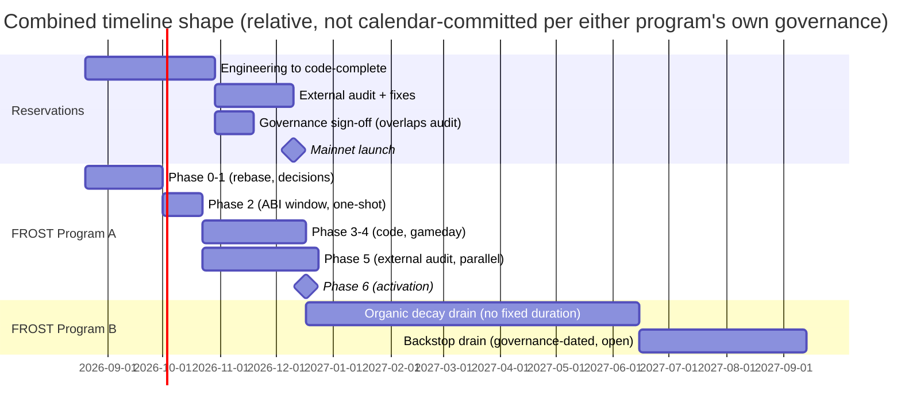

# FROST/Schnorr Migration vs. UTXO Reservations — Conflict Analysis and Combined Timeline

Status: DRAFT, 2026-08-20. Investigated via `tlabs-xyz/frost-upgrade` (the FROST migration's own
analysis corpus) plus direct code reads of the actual FROST PR branches
(`tbtc-v2#971`→`#1027`/`#972`/`#973`, `keep-core#3866`→`#4199`→`#4226`, `#4005`→`#4198`→`#4227`) and
the reservations branches (`tbtc-v2#1088`→...→`#1096`, `keep-core#4238`), cross-referenced directly —
not inferred from either project's own docs, since **the FROST corpus explicitly scopes reservations
out and has never analyzed this interaction**, and the reservations spec never mentions FROST. This
document is the first analysis of the actual intersection.

## 0. Direct answer

**Reservations do not need to expire, and do not need to preemptively migrate on a deadline.**
FROST's own governance already decided (`docs/adr/0017-fund-migration-own-timeline.md`, ratified
2026-08-10) that the ECDSA→FROST fund drain runs on **no committed calendar** — coexistence is
supported indefinitely as long as each ECDSA wallet's signing group stays healthy (passes its
heartbeat). A reservation anchored to a healthy ECDSA wallet can simply keep operating through its
full lifecycle (renew, partial-redeem, dissolve) with **zero interaction with FROST** for as long as
that wallet stays `Live`.

**When a reservation's wallet does eventually get pushed toward retirement** (either by the
governance-set backstop date once FROST's drain starts, or by that specific wallet's own heartbeat
failing and arming its 365-day `MovingFunds` clock), the reservation is **not stranded by default and
does not have to dissolve**. The reservations contract already has a first-class, already-implemented
mechanism for exactly this — `requestReservationReanchor` (`Reservation.sol:899-1014`), whose own doc
comment states it is *"used during wallet migration so reservations never pin retiring wallets."* It
moves a live reservation's anchor from a `MovingFunds` source wallet to any other `Live` wallet,
permissionlessly. The remaining question is whether "any other `Live` wallet" can be a FROST wallet as
things stand today — answered in §2.

## 1. Terminology collision — read this before the words "P2TR" and "reservation" appear together anywhere else

**FROST's own codebase has an unrelated internal concept also called "reservation."**
`solidity/contracts/bridge/P2TRReservation.sol` on the FROST branch (confirmed present at
`/tmp/tbtc-v2-frost/solidity/contracts/bridge/P2TRReservation.sol`, 1,457 diff lines) is *"a canonical
resource namespace and one fail-closed registry adapter"* for FROST's own P2TR fraud-proof
challenge-slot accounting — it has nothing to do with the UTXO Reservations feature. Likewise, phrases
like *"admission reservation gating"* and *"capacity reservation"* found in the FROST audit corpus
(`outputs/frost-schnorr-migration-review-audit-keyhandling.md`) refer to FROST's own anchor-service
admission control, not this feature. **Every finding below is about `tbtc-v2#1088`'s UTXO Reservations
feature specifically**, cited by its actual file names (`Reservation.sol`, `ReservationProofs.sol`,
`ReservationVault.sol`, `ReservationRouter.sol`).

## 2. Can a reservation's anchor actually re-anchor to a FROST wallet? — the code-level answer

Three separate questions, each answered directly against the real branch code (not the FROST corpus's
own analysis, which never covers this):

### 2.1 Does a FROST wallet even appear in the registry reservations checks against?

**Yes — and this required directly overriding a subagent's finding that got it wrong.** A dispatched
scout initially reported that FROST uses "a separate, non-interoperable wallet registry" and that
`Wallets.sol` "does not exist" on the FROST branch — both false, verified by direct read:
`/tmp/tbtc-v2-frost/solidity/contracts/bridge/Wallets.sol` exists (594 diff lines against main) and
`requestReservationReanchor`'s check (`self.registeredWallets[targetWalletPubKeyHash].state ==
Wallets.WalletState.Live`) **would in fact recognize a FROST wallet as valid**, because FROST wallets
are deliberately unified into that exact mapping via a synthetic **compatibility PKH**:
`HASH160(0x02 || xOnlyKey)`, a real 20-byte hash that slots into the same `bytes20`-keyed
`registeredWallets` map ECDSA wallets use. This is proven functionally, not just by reading the
registration code, by a real integration test on the FROST branch —
`solidity/test/integration/EcdsaToFrostMovingFunds.test.ts` — which asserts directly:
`(await bridge.wallets(frostWalletPubKeyHash)).state == walletState.Live` after registering a FROST
wallet, and separately proves a real ECDSA wallet's `MovingFunds` settlement can pay a genuine P2TR
output that resolves through this same mapping to a `MovedFundsSweepRequest` **for the FROST wallet**.
The `bytes20` reservation identifier type is consequently **not a structural blocker** — a second
subagent's claim that "a 32-byte P2TR key cannot fit into `bytes20`, blocking P2TR anchoring
entirely" is also wrong; it missed the compat-PKH mechanism this section just verified.

### 2.2 Does the reservation settlement's own output-verification accept a P2TR output?

**Not yet, as literally written today — but the fix is small and precisely identified.**
`ReservationProofs.sol` verifies every anchor/re-anchor/dissolution settlement output via
`self.extractPubKeyHash(output)` (4 call sites: `:437`, `:924`, `:987`, `:1214`). This exact function,
on the FROST branch (`BitcoinTx.sol:383-398`), was **deliberately left in place unchanged in behavior
except one addition: it now explicitly `revert("P2TR wallet outputs are not enabled")` if given a P2TR
script.** FROST did not extend this function — it added two new, differently-named siblings instead:
`extractWalletID` and `extractWalletPubKeyHash` (`BitcoinTx.sol:403-433`), the latter of which resolves
a P2TR output through the compat-PKH mapping exactly as `EcdsaToFrostMovingFunds.test.ts` exercises.
Confirmed by checking every remaining caller of the two functions on the FROST branch: `DepositSweep.sol`,
`MovingFunds.sol`, and `P2TRPreSigning.sol` all call the new `extractWalletPubKeyHash`; the old
`extractPubKeyHash` has **zero production callers left** on the FROST branch (only a test-harness
wrapper). This is a strong signal about intent: `extractPubKeyHash` is being kept as a deliberate
P2TR-rejection point for call sites that haven't been upgraded yet — and reservations, which doesn't
exist on the FROST branch, is exactly such an unmigrated call site.

**The reservations branch does not touch `BitcoinTx.sol` at all** (verified: `git diff origin/main --
solidity/contracts/bridge/BitcoinTx.sol` on the reservations branch returns zero lines). This means
there is no merge conflict on this file — FROST's extension applies cleanly regardless of merge order.
**The concrete, scoped fix once both features are combined:** swap `self.extractPubKeyHash(output)` for
`self.extractWalletPubKeyHash(output)` at `ReservationProofs.sol`'s 4 call sites. Same return type
(`bytes20`), same calling convention, no other reservation-side logic changes — this is a small, precise
patch, not a data-model redesign.

### 2.3 Does keep-core's reservation wallet-action code need FROST-specific work?

**Yes, real work — this is the one place a subagent's finding holds up.** Reservation transaction
assembly in `keep-core` (`pkg/tbtc/reservation.go`, exercised by
`TestAssembleReservedRedemptionTransaction`/`TestAssembleReservationDissolutionTransaction`) calls
`pkg/bitcoin`'s `TransactionBuilder.AddPublicKeyHashInput` (P2WPKH-specific) and an ECDSA-specific
`AddSignatures` path. The FROST branch's `TransactionBuilder` adds a sibling method,
`AddTaprootKeyPathInput`, plus Schnorr signing, in the same file — meaning the extension point already
exists structurally (FROST proved the builder pattern is extensible), but reservation's own action code
would need a scheme-aware branch calling the Taproot path for a FROST-targeted re-anchor/dissolution,
which is genuine, non-trivial new work, not a two-line change. Given keep-core's reservation PR
(`#4238`) is already a generation behind the two-phase Solidity design (per
`feature-spec.md` §16) and has zero coordination-executor wiring, this FROST-awareness work
naturally lands as part of — not before — the already-identified "second, currently-unwritten keep-core
PR" that implements the two-phase protocol client-side.

## 3. Storage and merge-conflict risk between the two PR stacks

Real diff-stat intersection (not assumed — computed directly against each branch's own merge-base):

| File | Reservations diff | FROST diff | Risk |
|---|---|---|---|
| `BridgeState.sol` | +172/−? | +377/−? | **Highest** — both extend the shared storage struct; append-order must be reconciled at merge time, and each branch's own storage-layout parity test only checks its own increment, not the combined one |
| `Bridge.sol` | +86 | +888 | High — FROST's diff is 10x larger; real functional overlap likely on wallet-state read paths |
| `Wallets.sol` | +93 | +594 | High — same reasoning |
| `MovingFunds.sol` | +68 | +183 | Medium |
| `BridgeGovernance.sol` / `BridgeGovernanceParameters.sol` | +139 / +133 | +228 / +35 | Medium |
| `Deposit.sol` / `DepositSweep.sol` | +56 / +15 | +452 / +91 | Medium |
| `Redemption.sol` / `RedemptionWatchtower.sol` | +44 / +226 | +128 / +79 | Medium — `RedemptionWatchtower.sol` already exists pre-both-branches; both append to it independently |
| `WalletProposalValidator.sol` | +418 | +205 | Medium |
| `MaintainerProxy(V2).sol` | +84 (V2, new) | +45 (V1, modified) | Low-medium — reservations creates a V2 proxy; FROST modifies V1; reconcile which is canonical post-merge |
| `BridgeStub.sol` (test) | +51 | +309 | Low — test-only |

**Verdict: real, non-trivial merge risk, concentrated in `BridgeState.sol`/`Bridge.sol`/`Wallets.sol`,
but not a blocking architectural conflict.** Both PRs individually claim (and CI-enforce via their own
storage-layout parity tests) to be storage-append-only. Landing both requires a real rebase with manual
conflict resolution on these three files, followed by **a combined storage-layout parity test run
against the merged result** — neither branch's own test covers the other's slots. This is exactly the
kind of gap the reservations testing plan (`testing-plan.md` §3 Tier 1) already flags for
Foundry invariant coverage; extend that recommendation to explicitly include a post-merge combined
storage-layout check once both features are ready to land together.

## 4. Balance-accounting correctness — verified, no fix needed

`getWalletBtcBalance` (`Wallets.sol:766-794`, on the reservations branch) derives a wallet's BTC
balance **purely from `mainUtxoHash`/`walletMainUtxo.txOutputValue`** — it never reads
`walletReservationsAmount`. This is what `submitMovingFundsCommitment`'s `expectedTargetWalletsCount =
min(liveWalletsCount, ceilDiv(walletBtcBalance, walletMaxBtcTransfer))` arithmetic uses
(`MovingFunds.sol:213-234`). **Reservation-anchored BTC is therefore already correctly excluded from
FROST's generic even-split drain arithmetic** — a live reservation's value will never accidentally get
redistributed as part of a wallet's `MovingFunds` commitment. This matches `moveFunds`'s existing
correct behavior (§0): a wallet with reservations but zero main UTXO still enters `MovingFunds` rather
than closing immediately, so the two features' balance models were already compatible before any FROST
code existed — likely because reservations was built to segregate custody deliberately, and that same
segregation happens to be exactly what FROST's drain needs.

## 5. Governance and calendar shape (from FROST's own current roadmap, 2026-08-12)

FROST restructured into **two independently-clocked programs** after ADR-0017 (2026-08-10) — the
outputs/ narrative reports' "5-22 months, one program" framing is superseded by this split:

- **Program A (protocol upgrade)**: FROST activates and coexists with ECDSA. Phases 0-6, gated
  sequence, ends at "a FROST wallet is live on mainnet and taking deposits." The [ESTIMATE] 5-22 month
  envelope from the older ops doc (dominated by external audit queue depth and DKG-ceremony throughput
  if the nominal 10-BTC-per-target cap is chosen) is the only quantified estimate in the corpus and
  hasn't been superseded by a newer number — treat it as still the best available bracket for Program
  A alone.
- **Program B (fund migration/drain)**: starts only after Program A activates, **carries no committed
  duration by explicit governance decision**, and runs on organic decay (redemption outflow from ECDSA
  + deposit inflow to FROST) plus a **mandatory but undated backstop**: any individual ECDSA wallet
  whose heartbeat fails arms an automatic, non-extendable 365-day `MovingFunds` clock, independent of
  whether the governance backstop date has been set yet.
- **Reservations' own timeline** (`timeline-estimate.md`): ~13-18 weeks (~3.25-4.5 months)
  to mainnet-ready, dominated by its own audit engagement, not FROST's.

**These two timelines do not force sequencing on each other.** Reservations can launch and operate on
ECDSA wallets throughout the entirety of FROST's Program A (activation) and the early, organic-decay
part of Program B, with zero required interaction, because Program B's backstop is explicitly
open-ended pending a separate governance decision. The one real coupling point is operational, not
calendar-based: **whichever wallet a reservation is anchored to must stay heartbeat-healthy**, because
an unhealthy wallet's 365-day clock is the one clock that cannot be paused once armed.

## 6. Recommended operational steps to add to the reservations plan

None of these block reservations' current launch plan (`epic-merge-plan.md`). They are
follow-up items to track once FROST Program A activates:

1. **Track FROST Program A's activation milestone**, not its whole timeline — that's the point at which
   a `Live` FROST wallet first exists to re-anchor into, and the point after which `2.1`/`2.2`'s findings
   become actionable rather than theoretical.
2. **Once FROST activates, patch `ReservationProofs.sol`'s 4 `extractPubKeyHash` call sites to
   `extractWalletPubKeyHash`** (§2.2) — small, precisely scoped, no data-model change. This is a
   prerequisite for `requestReservationReanchor` settlements to a FROST target to ever complete
   on-chain (the request-side check already works per §2.1; only the settlement-side output check needs
   this).
3. **Scope the keep-core FROST-aware reservation transaction assembly** (§2.3 — `AddTaprootKeyPathInput`
   + Schnorr signing branch) as part of the already-planned "second keep-core PR" for the two-phase
   protocol, not as separate scope creep.
4. **Add a combined storage-layout parity test** covering both branches' final merged state (§3) —
   extend `testing-plan.md`'s Tier 1 Foundry recommendation to explicitly include this once
   both features are close to landing together.
5. **Monitor wallet heartbeat health for any wallet carrying live reservations** (§5) — this is the one
   genuinely time-sensitive operational coupling. A reservation anchored to a wallet whose heartbeat
   fails inherits that wallet's non-extendable 365-day clock; the re-anchor request should be filed
   (permissionlessly, once the wallet enters `MovingFunds`) well before that clock's tail end, not at
   the deadline.
6. **No action needed to "let covenants expire."** Nothing in either corpus requires reservations to
   dissolve ahead of FROST — the re-anchor path is the intended, already-built migration mechanism, and
   both governance decisions (reservations launching now, FROST's backstop being undated) support
   coexistence rather than forced sequencing.
