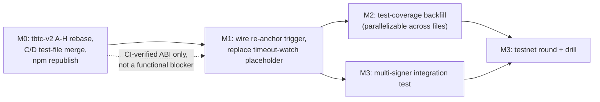

# Implementation Plan: keep-core M1 Reservation Readiness

Synthesizes `01-gap-analysis.md`, `02-user-stories.md`, and `03-delta-changes.md` into a
sequenced, file-level execution plan. Scope: M1 (creation, custody, re-anchor only) per the
settled variant B decision (`feature-spec.md:9-15`, `milestone-inventory.md:7`,
`roadmap.md` §0.1-0.2) — nothing here targets redemption, dissolution, renewal, or the
watchtower veto.

## Milestone 0: Unblock ABI verification (external dependency, not a keep-core code change)

The npm-publish blocker (`01-gap-analysis.md` Blocker row) is a tbtc-v2-release-process
dependency, not a keep-core defect — the bindings currently checked into `/tmp/m1-h`
(`pkg/chain/ethereum/tbtc/gen/`) already work locally, but CI's clean-room `make generate`
cannot reproduce them until `@keep-network/tbtc-v2` is republished with the reservation
surface. This milestone has no keep-core file-level tasks; it is a prerequisite gate for
CI-verified confidence in every ABI-touching task below.

| Task | Depends on | Effort |
| :--- | :--- | :--- |
| Rebase tbtc-v2 PRs B (`#1110`), D (`#1108`), F (`#1111`), G (`#1112`) onto merged A (`#1106`) — all four currently show `mergeable: CONFLICTING` against `reservations-upgrade` | A already merged | 0.5-1 day per PR, parallelizable |
| Resolve the C/D same-path collision on `solidity/test/bridge/Reservation.test.ts` (both PRs independently add this file; a naive merge conflict resolution risks silently dropping one side's tests) — hand-merge the two test files' content when C and D are sequenced | C, D both rebased | 0.5 day |
| Merge the full A-H stack into `reservations-upgrade`, then promote/publish to whichever branch triggers the `@keep-network/tbtc-v2` npm publish workflow (`contracts.yml`: `push: branches: [main]`, or a deliberate `workflow_dispatch`) | All of the above | 1-2 days, contingent on tbtc-v2 review completing (C, E already `MERGEABLE`/`CLEAN`) |
| Re-run `make generate` in keep-core against the republished package; confirm `client-build-test-publish` goes green on PR #4274 | npm republish complete | 0.5 day |

## Milestone 1: Close the functional gaps (Blocker + Major rows)

**Status: DONE.** Rows 1-2: implemented and tested, PR [#4276](https://github.com/threshold-network/keep-core/pull/4276)
(branch `m1/reservation-readiness-fixes` on top of `m1/keep-core-client`). Row 2's production
trigger is not yet live - see its caveat below; this is a pre-existing gap, not new scope creep
from that PR. Row 3: implemented and tested, PR [#4277](https://github.com/threshold-network/keep-core/pull/4277)
(branch `m1/reservation-protobuf-marshaling`, stacked on #4276).

**Blocker found and fixed this session, outside this milestone's original three rows:**
`pkg/tbtc/coordination.go`'s `getActionsChecklist` never included `ActionReservationAnchor`/
`ActionReservationReanchor`, so the reservation acceptance/re-anchor proposal tasks registered in
`pkg/tbtcpg.NewProposalGenerator` were structurally unreachable in production regardless of rows
1-3 landing - see `01-gap-analysis.md` Blocker row 2. Fixed and tested, PR [#4278](https://github.com/threshold-network/keep-core/pull/4278)
(stacked on #4277).

| File | Task | Traces to | Effort | Test-acceptance criteria |
| :--- | :--- | :--- | :--- | :--- |
| `pkg/maintainer/spv/reservation_reanchor_proof.go` + `pkg/maintainer/spv/spv.go` | ~~Wire `submitReservationReanchorProof` to `WalletMovingFunds` in `reservation_wiring.go`~~ **Corrected during implementation**: the trigger/proposal path (`ReservationReanchorTask`, registered in `tbtcpg.NewProposalGenerator`) already existed - `reservation_wiring.go` was never the right file. The actual gap was SPV proof submission: `spv.go`'s generic proof-loop signature can't carry `(reservationKey, requestNonce)`. Fix: real `getUnprovenReservationReanchorTransactions` getter (matches candidate transactions via `ReservationByAnchorUtxo`) and `reservationReanchorTransactionProofSubmitter` (re-derives the key/nonce pair, then calls `SubmitReservationReanchorProof`) | Gap-analysis Major row 2 | S (0.5 day) | **Done.** New unit tests for discovery precision (shape mismatch, anchor mismatch, settled-action skip) and submitter key/nonce derivation, plus two regression tests added later this session for a nonce-staleness fix (stale action generation, mismatched target wallet) - see `reservation_reanchor_proof_test.go` |
| `pkg/maintainer/spv/reservation_action_timeout_watch.go` | Replace `Run()`'s admitted placeholder (`:141-144`) with a real polling loop that calls `CheckReservationActionTimeouts` (`:186`) per registered wallet, per the file's own doc-comment-stated follow-up | Gap-analysis Minor row 1 | M (0.5-1 day) | **Loop logic done and tested:** unit tests cover `WatchWallet` dedup, all three `Run` precondition guards, and an end-to-end test that `Run` notifies a timed-out action on its first iteration and returns promptly on `ctx` cancellation - see `reservation_action_timeout_watch_test.go`. **Caveat:** `WatchWallet` has zero production callers under `pkg/` - `WireReservationWatchers` starts `Run`'s loop but never registers a wallet with it, because the wallet-ID -> public-key-hash discovery step is a pre-existing gap shared by all three reservation watchers (stranding, stale-deposit, action-timeout) - see the "PR H placeholder" comments in `reservation_wiring.go`. Not touched here. |
| `pkg/tbtc/reservation.go` + `pkg/tbtc/marshaling.go` + `pkg/tbtc/gen/pb/message.proto` | Switch the four `CoordinationProposal.Marshal()`/`Unmarshal()` implementations from JSON to protobuf | Gap-analysis Major row 1 | **Done.** Added the four message types to `message.proto`, regenerated `message.pb.go` (`protoc` installed for this), moved Marshal/Unmarshal into `marshaling.go` matching the existing proto-based proposals' pattern | Roundtrip test per proposal type asserting `Unmarshal(Marshal(x)) == x` field-for-field (`TestCoordinationMessage_MarshalingRoundtrip`, extended); the pre-existing JSON-payload rejection test was ported to real protobuf payloads (`TestReservationProposals_UnmarshalRejectsInvalidFields`), not silently dropped |

## Milestone 2: Test-coverage backfill (Minor rows + Stories S7-S9)

**Status: DONE, 7 of 8 items.** PR [#4280](https://github.com/threshold-network/keep-core/pull/4280)
(branch `m1/reservation-test-coverage-backfill`, stacked on #4279). All items are new tests only —
no production-code changes required (confirmed by spot-checking existing test files in Phase 2;
see `03-delta-changes.md` rows 15 and 17 for the two rows where this was explicitly verified
against current test content, not assumed). The one deferred item (Story S8) needs
simulated-backend test infrastructure this repository doesn't have; see `01-gap-analysis.md`'s
new Minor row.

| File | Task | Traces to | Effort |
| :--- | :--- | :--- | :--- |
| `pkg/tbtc/reservation_test.go` | **Done.** Added a happy-path shape test for `assembleReservationAnchorTransaction` — the prior test only covered the nil-deposit error path | Gap-analysis Minor "ReservationAnchorProposal assembler logic" | S (0.25 day) |
| `pkg/tbtc/reservation_test.go` | **Done.** Added a happy-path shape test for `assembleReservationReanchorTransaction` | Gap-analysis Minor "ReservationReanchorProposal assembler logic" | S (0.25 day) |
| `pkg/chain/ethereum/tbtc_test.go` | **Done.** Added a field-mapping test for `convertReservationParametersFromAbiType` asserting the full 10-tuple maps correctly | Gap-analysis Minor "ReservationParameters converter mapping" | S (0.25 day) |
| `pkg/chain/ethereum/tbtc_test.go` | **Done.** Added a test documenting the intentional `CumulativeReanchorFee` drop in the `GetReservation` converter so a future accidental field restoration doesn't go unnoticed | Gap-analysis Minor "GetReservation converter fee field drop" | S (0.25 day) |
| `pkg/tbtcpg/reservation_acceptance_test.go` | **Done.** Added explicit at-limit/one-over-limit boundary tests (6 cases) for `MaxReservationsPerWallet`, `ReservationMinAmount`, `ReservationMaxTotalAmount` — the prior `TestReservationAcceptanceTask_BoundedLookback` used these fields as fixture data only, never at the boundary | Story S7 | M (0.5 day, 3 boundary cases) |
| `pkg/chain/ethereum/tbtc_test.go` | **Deferred.** `ValidateReservationAnchorProposal`/`ValidateReservationReanchorProposal` both call a real generated contract binding, not a pure function; `pkg/chain/ethereum` has no simulated-backend test infrastructure to reuse, and building it is well beyond this row's 0.5-day estimate. Explicitly investigated and not built this session; see `01-gap-analysis.md`'s new Minor row | Story S8 | M (0.5 day) — **infeasible at this effort; real cost is building simulated-backend infra from scratch** |
| `pkg/tbtcpg/reservation_acceptance_test.go` | **Done.** Added a test running the same task twice against the same deposit, mutating `ReservationMinAmount` between calls, proving `ReservationParameters()` is fetched live, not cached | Story S9 | S (0.25 day) |
| `pkg/tbtcpg/reservation_acceptance.go` + `pkg/tbtc/reservation.go` | **Done, via the cheaper option.** `buildReservationAnchorTransaction`/`assembleReservationAnchorTransaction` are both unexported in different packages, so a true cross-reference test calling both is not mechanically possible without a production-code change. Added independent golden-value tests in each package pinning identical input/output values instead; the underlying duplication remains, extracting a shared helper is still the real fix | Gap-analysis Minor "Redundant anchor assembly code" | M (0.5 day for the cross-reference test; L, 1-2 days, if extracting a shared helper across the package boundary) |

## Milestone 3: Coordination-level verification (not file-level tasks — carried over, not net-new)

These were established earlier in this engagement as launch gates independent of PR #4238/#4274
merging; listed here only to show how Milestones 1-2 feed into them, not re-specified.

- **Multi-signer simulated integration test** — **Done**, PR [#4279](https://github.com/threshold-network/keep-core/pull/4279)
  (branch `m1/reservation-multisigner-integration-test`, stacked on #4278). Scales
  `TestCoordinationExecutor_Coordinate`'s existing 3-operator harness to
  `ReservationAnchorProposal`/`ReservationReanchorProposal`, exercising Story S1's "integration"
  test level and the M1 acceptance/re-anchor coordination-leader/follower round-trip that no
  mocked unit test in Milestone 1-2 can cover. Depended on the Milestone 1 checklist-gap fix
  (#4278) to be reachable at all; verified by temporarily reverting that fix and confirming the
  new tests fail as expected, then restoring it.
- **Testnet round with a forced liveness/stranding drill** (~2 weeks) — exercises Stories S3-S5
  (stranding via all three termination causes) under real wallet-lifecycle timing, not simulated
  state transitions. **Not started** — operational (live testnet deployment, real multi-operator
  calendar time), not a code task; explicitly out of scope for this engagement per decision this
  session. Remains agent-not-actionable.

## Sequencing

- Milestone 0 gates CI-verified confidence in ABI-bound code, not local development — Milestone 1
  and the `tbtc.go`-touching rows of Milestone 2 can be developed and unit-tested locally against
  the already-checked-in bindings without waiting on M0, but should not be called "CI-green" until
  M0 completes.
- Milestone 1's two wiring tasks are prerequisites for Milestone 3's multi-signer test to exercise
  real re-anchor and timeout behavior rather than a hand-invoked code path.
- Milestone 2 is fully parallelizable across files/engineers; no task depends on another within it.
- **Final state (this session): Milestones 1-3 done except two explicitly deferred items** -
  Milestone 1 row 3's protobuf switch (#4277), the checklist-wiring blocker found and fixed
  outside the original three rows (#4278), Milestone 2's 7/8 test-coverage items (#4280, one
  deferred - Story S8 needs simulated-backend infra this repo doesn't have), and Milestone 3's
  multi-signer integration test (#4279, one item - the testnet drill - out of scope, operational
  not code). PR chain: #4276 → #4277 → #4278 → #4279 → #4280, all draft, awaiting human
  review/merge in that order. Milestone 0 remains an external tbtc-v2 release-coordination
  dependency, not keep-core engineering.
