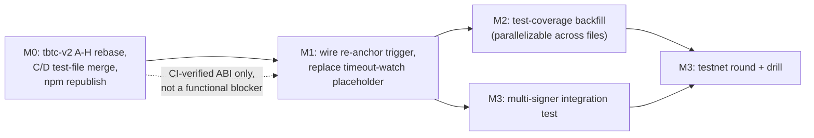

# Implementation Plan: keep-core M1 Reservation Readiness

Synthesizes `01-gap-analysis.md`, `02-user-stories.md`, and `03-delta-changes.md` into a
sequenced, file-level execution plan. Scope: M1 (creation, custody, re-anchor only) per the
settled variant B decision (`feature-spec.md:9-15`, `milestone-inventory.md:7`,
`roadmap.md` §0.1-0.2) — nothing here targets redemption, dissolution, renewal, or the
watchtower veto.

## Milestone 0: Unblock ABI verification (external dependency, not a keep-core code change)

The npm-publish blocker (`01-gap-analysis.md` Blocker row) is a tbtc-v2-release-process
dependency, not a keep-core defect — the bindings currently checked into `/tmp/m1-h`
(`pkg/chain/ethereum/tbtc/gen/`) already work locally, but CI's clean-room `make generate`
cannot reproduce them until `@keep-network/tbtc-v2` is republished with the reservation
surface. This milestone has no keep-core file-level tasks; it is a prerequisite gate for
CI-verified confidence in every ABI-touching task below.

| Task | Depends on | Effort |
| :--- | :--- | :--- |
| Rebase tbtc-v2 PRs B (`#1110`), D (`#1108`), F (`#1111`), G (`#1112`) onto merged A (`#1106`) — all four currently show `mergeable: CONFLICTING` against `reservations-upgrade` | A already merged | 0.5-1 day per PR, parallelizable |
| Resolve the C/D same-path collision on `solidity/test/bridge/Reservation.test.ts` (both PRs independently add this file; a naive merge conflict resolution risks silently dropping one side's tests) — hand-merge the two test files' content when C and D are sequenced | C, D both rebased | 0.5 day |
| Merge the full A-H stack into `reservations-upgrade`, then promote/publish to whichever branch triggers the `@keep-network/tbtc-v2` npm publish workflow (`contracts.yml`: `push: branches: [main]`, or a deliberate `workflow_dispatch`) | All of the above | 1-2 days, contingent on tbtc-v2 review completing (C, E already `MERGEABLE`/`CLEAN`) |
| Re-run `make generate` in keep-core against the republished package; confirm `client-build-test-publish` goes green on PR #4274 | npm republish complete | 0.5 day |

## Milestone 1: Close the functional gaps (Blocker + Major rows)

**Status: done, PR [#4276](https://github.com/threshold-network/keep-core/pull/4276)** (both non-blocked rows below; branch `m1/reservation-readiness-fixes` on top of `m1/keep-core-client`).

| File | Task | Traces to | Effort | Test-acceptance criteria |
| :--- | :--- | :--- | :--- | :--- |
| `pkg/maintainer/spv/reservation_reanchor_proof.go` + `pkg/maintainer/spv/spv.go` | ~~Wire `submitReservationReanchorProof` to `WalletMovingFunds` in `reservation_wiring.go`~~ **Corrected during implementation**: the trigger/proposal path (`ReservationReanchorTask`, registered in `tbtcpg.NewProposalGenerator`) already existed - `reservation_wiring.go` was never the right file. The actual gap was SPV proof submission: `spv.go`'s generic proof-loop signature can't carry `(reservationKey, requestNonce)`. Fix: real `getUnprovenReservationReanchorTransactions` getter (matches candidate transactions via `ReservationByAnchorUtxo`) and `reservationReanchorTransactionProofSubmitter` (re-derives the key/nonce pair, then calls `SubmitReservationReanchorProof`) | Gap-analysis Major row 2 / Story S6 | **Actual: ~1 day** (original 0.5-day estimate assumed the wrong, smaller fix; discovering the real SPV-side gap and its correct fix took materially longer) | **Done:** unit tests cover discovery precision (shape mismatch, anchor mismatch, settled-action skip) and submitter key/nonce derivation - see `reservation_reanchor_proof_test.go` |
| `pkg/maintainer/spv/reservation_action_timeout_watch.go` | Replace `Run()`'s admitted placeholder (`:141-144`) with a real polling loop that calls `CheckReservationActionTimeouts` (`:186`) per registered wallet, per the file's own doc-comment-stated follow-up | Gap-analysis Minor row 1 | M (0.5-1 day) | **Done:** unit tests cover `WatchWallet` dedup, all three `Run` precondition guards, and an end-to-end test that `Run` notifies a timed-out action on its first iteration and returns promptly on `ctx` cancellation - see `reservation_action_timeout_watch_test.go` |
| `pkg/tbtc/reservation.go` | Switch the four `CoordinationProposal.Marshal()`/`Unmarshal()` implementations (`:210`, `:260`, `:315`, `:368`) from JSON to protobuf | Gap-analysis Major row 1 | **Blocked** — requires a `pkg/tbtc/gen/pb` message-type schema change first, which is a separate cross-cutting task outside this plan's file scope. Once the schema lands: M-L (0.5-2 days) for the four swaps + roundtrip tests | Roundtrip test per proposal type asserting `Unmarshal(Marshal(x)) == x` field-for-field; existing JSON roundtrip tests (if any) must be ported, not silently dropped |

## Milestone 2: Test-coverage backfill (Minor rows + Stories S7-S9)

All items are new tests only — no production-code changes required (confirmed by spot-checking
existing test files in Phase 2; see `03-delta-changes.md` rows 15 and 17 for the two rows where
this was explicitly verified against current test content, not assumed).

| File | Task | Traces to | Effort |
| :--- | :--- | :--- | :--- |
| `pkg/tbtc/reservation_test.go` | Add a happy-path shape test for `assembleReservationAnchorTransaction` — current test (`:587`) only covers the nil-deposit error path | Gap-analysis Minor "ReservationAnchorProposal assembler logic" | S (0.25 day) |
| `pkg/tbtc/reservation_test.go` | Add a happy-path shape test for `assembleReservationReanchorTransaction` (`:698` call site is also error-path only) | Gap-analysis Minor "ReservationReanchorProposal assembler logic" | S (0.25 day) |
| `pkg/chain/ethereum/tbtc_test.go` | Add a field-mapping test for `convertReservationParametersFromAbiType` (`tbtc.go:2779-2793`) asserting the full 10-tuple maps correctly | Gap-analysis Minor "ReservationParameters converter mapping" | S (0.25 day) |
| `pkg/chain/ethereum/tbtc_test.go` | Add a test documenting the intentional `CumulativeReanchorFee` drop in the `GetReservation` converter (`tbtc.go:3211`) so a future accidental field restoration doesn't go unnoticed | Gap-analysis Minor "GetReservation converter fee field drop" | S (0.25 day) |
| `pkg/tbtcpg/reservation_acceptance_test.go` | Add explicit at-limit/one-over-limit boundary tests for `MaxReservationsPerWallet` (`:424`), `ReservationMinAmount` (`:443`), `ReservationMaxTotalAmount` (`:475-478`) — existing `TestReservationAcceptanceTask_BoundedLookback` (`:458-530`) uses these fields as fixture data but does not exercise boundary crossing | Story S7 | M (0.5 day, 3 boundary cases) |
| `pkg/chain/ethereum/tbtc_test.go` | Add tests for `ValidateReservationAnchorProposal` (`:2541-2597`) and `ValidateReservationReanchorProposal` (`:2617-2647`) covering both the valid-proposal and validator-reverts-false paths | Story S8 | M (0.5 day) |
| `pkg/tbtcpg/reservation_acceptance_test.go` | Add a test asserting `ReservationParameters()` is fetched live (not cached) across two sequential proposal generations with an intervening parameter change (`:133`) | Story S9 | S (0.25 day) |
| `pkg/tbtcpg/reservation_acceptance.go` + `pkg/tbtc/reservation.go` | Resolve the `buildReservationAnchorTransaction` duplication (`reservation_acceptance.go:578-582`) — either extract a shared helper or add a byte-identical-output cross-reference test between the two independent implementations | Gap-analysis Minor "Redundant anchor assembly code" | M (0.5 day for the cross-reference test; L, 1-2 days, if extracting a shared helper across the package boundary) |

## Milestone 3: Coordination-level verification (not file-level tasks — carried over, not net-new)

These were established earlier in this engagement as launch gates independent of PR #4238/#4274
merging; listed here only to show how Milestones 1-2 feed into them, not re-specified.

- **Multi-signer simulated integration test** (5-7 days) — exercises Story S1's "integration"
  test level and the M1 acceptance/re-anchor coordination-leader/follower round-trip that no
  mocked unit test in Milestone 1-2 can cover.
- **Testnet round with a forced liveness/stranding drill** (~2 weeks) — exercises Stories S3-S5
  (stranding via all three termination causes) under real wallet-lifecycle timing, not simulated
  state transitions.

## Sequencing

- Milestone 0 gates CI-verified confidence in ABI-bound code, not local development — Milestone 1
  and the `tbtc.go`-touching rows of Milestone 2 can be developed and unit-tested locally against
  the already-checked-in bindings without waiting on M0, but should not be called "CI-green" until
  M0 completes.
- Milestone 1's two wiring tasks are prerequisites for Milestone 3's multi-signer test to exercise
  real re-anchor and timeout behavior rather than a hand-invoked code path.
- Milestone 2 is fully parallelizable across files/engineers; no task depends on another within it.
- Total keep-core engineering effort, Milestones 1-2: Milestone 1 actual (done, PR #4276) - 1
  SPV proof-loop task (~1 day) + 1 polling-loop task (M, 0.5-1 day) ≈ **1.5-2 days**. Milestone 2
  remaining: 7 test tasks (mostly S, one M) + 1 dedup task (M/L) ≈ **3-4 engineer-days**,
  excluding the protobuf-schema-blocked task, Milestone 0 (release coordination, not
  engineering), and Milestone 3 (5-7 days + ~2 weeks, previously scoped).
