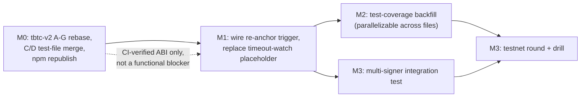

# Implementation Plan: keep-core M1 Reservation Readiness

Synthesizes `01-gap-analysis.md`, `02-user-stories.md`, and `03-delta-changes.md` into a
sequenced, file-level execution plan. Scope: M1 (creation, custody, re-anchor only) per the
settled variant B decision (`feature-spec.md:9-15`, `milestone-inventory.md:7`,
`roadmap.md` §0.1-0.2) — nothing here targets redemption, dissolution, renewal, or the
watchtower veto.

## Milestone 0: Unblock ABI verification (external dependency, not a keep-core code change)

**Status (2026-09-28): the immediate CI symptom is resolved by a workaround; the underlying
dependency this milestone describes is still open.** The A-G tbtc-v2 stack (rows 1-3 below; H is keep-core PR #4274 on the `reservations-epic` branch, not part of this Solidity stack) did
merge into `reservations-upgrade` (`#1106`, `#1108`, `#1110`, `#1111`, `#1112`, all merged
2026-09-03), but `reservations-upgrade` itself has not merged to `dev`/`main` (tracker PR #1116
is still an OPEN draft), so `@keep-network/tbtc-v2@development` never republished with the
reservation surface and row 4 (the real npm-based `make generate` fix) never happened. Instead,
keep-core worked around the CI failure directly: commit `64d0e6937`
(`fix(gen): vendor ReservationRouter artifact fallback for missing npm dev package`) adds a
development-only vendored ABI fallback, byte-identical to the committed bindings and
re-verifiable via `make verify-vendored-fallback`; non-development builds still hard-fail if the
real artifact is missing. `01-gap-analysis.md`'s CI blocker row is Resolved on that basis — but
the real npm publish this milestone was written to unblock remains gated on `reservations-upgrade`
merging to `dev`/`main`, which is a tbtc-v2 release-coordination decision, not a keep-core task.

This milestone has no remaining keep-core file-level tasks.

| Task | Depends on | Effort | Status |
| :--- | :--- | :--- | :--- |
| Rebase tbtc-v2 PRs B (`#1110`), D (`#1108`), F (`#1111`), G (`#1112`) onto merged A (`#1106`) | A already merged | 0.5-1 day per PR, parallelizable | **Done** — all merged 2026-09-03 |
| Resolve the C/D same-path collision on `solidity/test/bridge/Reservation.test.ts` | C, D both rebased | 0.5 day | **Done** — folded into the merge above |
| Merge the full A-G Solidity stack into `reservations-upgrade` (H is keep-core #4274 on `reservations-epic`, not part of this Solidity stack), then promote/publish to whichever branch triggers the `@keep-network/tbtc-v2` npm publish workflow | All of the above | 1-2 days | **Partially done** — A-G merged into `reservations-upgrade`; publish to `dev`/`main` still blocked on tracker PR #1116, which as of 2026-09-28 is OPEN, draft, and CONFLICTING with `dev` (100 ahead / 191 behind — reconcile before merge; see `docs/plans/m1-delivery.md` current status) |
| Re-run `make generate` in keep-core against the republished package; confirm `client-build-test-publish` goes green | npm republish complete | 0.5 day | **Superseded** — worked around via commit `64d0e6937`'s vendored ABI fallback instead of waiting on the republish |

## Milestone 1: Close the functional gaps (Blocker + Major rows)

**Status: DONE.** Rows 1-2: implemented and tested, PR [#4276](https://github.com/threshold-network/keep-core/pull/4276)
(branch `m1/reservation-readiness-fixes` on top of `m1/keep-core-client`). Row 2's production
trigger is not yet live - see its caveat below; this is a pre-existing gap, not new scope creep
from that PR. Row 3: the JSON-to-protobuf switch itself (message definitions, generated
bindings, `Marshal`/`Unmarshal` implementations) landed on the base branch via #4276, not in
#4277's diff; PR [#4277](https://github.com/threshold-network/keep-core/pull/4277)
(branch `m1/reservation-protobuf-marshaling`, stacked on #4276) added the marshaling/fuzz test
coverage only.

**Blocker found and fixed this session, outside this milestone's original three rows:**
the reservation actions were present in `getActionsChecklist` but frequency-gated (every Nth
coordination window, the same throttle `DepositSweep`/`MovingFunds` use), so they only ran
periodically. #4278 made them unconditional, so they now run in every coordination window.
See `01-gap-analysis.md` Blocker row 2 (re-verified). Fixed and tested, PR
[#4278](https://github.com/threshold-network/keep-core/pull/4278) (stacked on #4277).

| File | Task | Traces to | Effort | Test-acceptance criteria |
| :--- | :--- | :--- | :--- | :--- |
| `pkg/maintainer/spv/reservation_reanchor_proof.go` + `pkg/maintainer/spv/spv.go` | ~~Wire `submitReservationReanchorProof` to `WalletMovingFunds` in `reservation_wiring.go`~~ **Corrected during implementation**: the trigger/proposal path (`ReservationReanchorTask`, registered in `tbtcpg.NewProposalGenerator`) already existed - `reservation_wiring.go` was never the right file. The actual gap was SPV proof submission: `spv.go`'s generic proof-loop signature can't carry `(reservationKey, requestNonce)`. Fix: real `submitReservationReanchorProof` getter (matches candidate transactions via `ReservationByAnchorUtxo`) and `submitReservationActionProof` (re-derives the key/nonce pair, then calls `SubmitReservationReanchorProof`) | Gap-analysis Major row (resolved) | S (0.5 day) | **Done.** New unit tests for discovery precision (shape mismatch, anchor mismatch, settled-action skip) and submitter key/nonce derivation, plus two regression tests added later this session for a nonce-staleness fix (stale action generation, mismatched target wallet) - see `reservation_reanchor_proof_test.go` |
| `pkg/maintainer/spv/reservation_action_timeout_watch.go` | Replace `Run()`'s admitted placeholder with a real polling loop that calls `CheckReservationActionTimeouts` per registered wallet, per the file's own doc-comment-stated follow-up | Gap-analysis Minor row (resolved) | M (0.5-1 day) | **Done and tested:** unit tests cover the action-timeout dedup, all three `Run` precondition guards, and an end-to-end test that `Run` notifies a timed-out action on its first iteration and returns promptly on `ctx` cancellation - see `reservation_action_timeout_watch_test.go`. `Run` is invoked directly by `WireReservationWatchers` (`reservation_wiring.go:451-466`), which runs an initial synchronous `pollPendingActions` pass before starting the loop; fully wired in production, no outstanding integration gap. |
| `pkg/tbtc/reservation.go` + `pkg/tbtc/marshaling.go` + `pkg/tbtc/gen/pb/message.proto` | Switch the four `CoordinationProposal.Marshal()`/`Unmarshal()` implementations from JSON to protobuf | Gap-analysis Major row (resolved) | **Done.** Added the four message types to `message.proto`, regenerated `message.pb.go` (`protoc` installed for this), moved Marshal/Unmarshal into `marshaling.go` matching the existing proto-based proposals' pattern | Roundtrip test per proposal type asserting `Unmarshal(Marshal(x)) == x` field-for-field (`TestCoordinationMessage_MarshalingRoundtrip`, extended); the pre-existing JSON-payload rejection test was ported to real protobuf payloads (`TestReservationProposals_UnmarshalRejectsInvalidFields`), not silently dropped |

## Milestone 2: Test-coverage backfill (Minor rows + Stories S7-S9)

**Status: DONE, 8 of 8 items (the last one closed on `fix/m1-cross-repo-review`), plus one item upgraded to a real production-code fix.** PR [#4280](https://github.com/threshold-network/keep-core/pull/4280)
(branch `m1/reservation-test-coverage-backfill`, stacked on #4279). Most items are new tests only
(confirmed by spot-checking existing test files in Phase 2; see `03-delta-changes.md` for the
rows where this was explicitly verified against current test content, not assumed) — the one
exception is the last row below, where the originally-planned golden-value test was superseded by
actually extracting and exporting the shared helper. The one deferred item (Story S8) was
closed on `fix/m1-cross-repo-review`: the in-memory EVM validator harness now exists
(`pkg/chain/ethereum/tbtc_validator_harness_test.go`), see `01-gap-analysis.md`'s
Minor row and `../testing-plan.md` §2.5.

| File | Task | Traces to | Effort |
| :--- | :--- | :--- | :--- |
| `pkg/tbtc/reservation_test.go` | **Done.** Added a happy-path shape test for `AssembleReservationAnchorTransaction` (landed as `TestAssembleReservationTransactions_HappyPathShape`, covering both anchor and re-anchor) — the prior test only covered the nil-deposit error path | Gap-analysis Minor "ReservationAnchorProposal assembler logic" | S (0.25 day) |
| `pkg/tbtc/reservation_test.go` | **Done.** Added a happy-path shape test for `AssembleReservationReanchorTransaction` (same `TestAssembleReservationTransactions_HappyPathShape` suite as the row above) | Gap-analysis Minor "ReservationReanchorProposal assembler logic" | S (0.25 day) |
| `pkg/chain/ethereum/tbtc_test.go` | **Done.** Added a field-mapping test for `convertReservationParametersFromAbiType` asserting the full 10-tuple maps correctly | Gap-analysis Minor "ReservationParameters converter mapping" | S (0.25 day) |
| `pkg/chain/ethereum/tbtc_test.go` | **Done.** Added a test documenting the intentional `CumulativeReanchorFee` drop in the `GetReservation` converter so a future accidental field restoration doesn't go unnoticed | Gap-analysis Minor "GetReservation converter fee field drop" | S (0.25 day) |
| `pkg/tbtcpg/reservation_acceptance_test.go` | **Done.** Added explicit at-limit/one-over-limit boundary tests (6 cases) for `MaxReservationsPerWallet`, `ReservationMinAmount`, `ReservationMaxTotalAmount` — the prior `TestReservationAcceptanceTask_BoundedLookback` used these fields as fixture data only, never at the boundary. Correction (2026-09-29, `fix/m1-cross-repo-review` final): the acceptance task no longer re-checks request-time caps, so the boundary rows now exercise the snapshotted minimum and cap-fixture data only; `TestReservationAcceptanceTask_IgnoresRequestTimeCaps` pins that saturated caps no longer gate consumption. | Story S7 | M (0.5 day, 3 boundary cases) |
| `pkg/chain/ethereum/tbtc_test.go` | **Closed on `fix/m1-cross-repo-review` (2026-09-28)** — the deferred item landed as `pkg/chain/ethereum/tbtc_validator_harness_test.go`: a go-ethereum in-memory EVM harness (`core/vm/runtime` over a shared `StateDB`) deploying the real `WalletProposalValidator` against a stub Bridge (`testdata/walletproposalvalidator/StubBridge.sol`); `TestValidateReservationAnchorProposal` / `TestValidateReservationReanchorProposal` cover both wrappers including revert-reason propagation. The in-memory EVM was chosen because `ethclient/simulated` cannot link under Go 1.24 (its `internal/debug` -> `fjl/memsize` dependency trips the Go 1.23+ linkname restriction that plain `go test` enforces). At the M1 pinned tip this row was explicitly investigated and not built; see `01-gap-analysis.md`'s Minor row and `../testing-plan.md` §2.5 | Story S8 | M (0.5 day) — **infeasible at this effort; real cost is building the validator-test infra once; now built as the shared harness** |
| `pkg/tbtcpg/reservation_acceptance_test.go` | **Done.** Added a test running the same task twice against the same deposit, mutating `ReservationMinAmount` between calls, proving `ReservationParameters()` is fetched live, not cached | Story S9 | S (0.25 day) |
| `pkg/tbtcpg/reservation_acceptance.go` + `pkg/tbtc/reservation.go` | **Done, via the real fix, not the cheaper option originally planned.** `AssembleReservationAnchorTransaction` was exported from `pkg/tbtc/reservation.go`, and `pkg/tbtcpg/reservation_acceptance.go:1109` now calls it directly — the duplicate `buildReservationAnchorTransaction` helper is deleted (zero grep hits in the tree), not merely golden-tested against; the underlying duplication no longer exists. | Gap-analysis Minor "Redundant anchor assembly code" (resolved) | L (1-2 days, actually spent — the shared-helper extraction originally deferred as the "real fix") |

## Milestone 3: Coordination-level verification (not file-level tasks — carried over, not net-new)

These were established earlier in this engagement as launch gates independent of PR #4238/#4274
merging; listed here only to show how Milestones 1-2 feed into them, not re-specified.

- **Multi-signer simulated integration test** — **Done**, PR [#4279](https://github.com/threshold-network/keep-core/pull/4279)
  (branch `m1/reservation-multisigner-integration-test`, stacked on #4278). Scales
  `TestCoordinationExecutor_Coordinate`'s existing 3-operator harness to
  `ReservationAnchorProposal`/`ReservationReanchorProposal`, exercising Story S1's "integration"
  test level and the M1 acceptance/re-anchor coordination-leader/follower round-trip that no
  mocked unit test in Milestone 1-2 can cover. Depended on the Milestone 1 checklist-gap fix
  (#4278) to be reachable at all; verified by temporarily reverting that fix and confirming the
  new tests fail as expected, then restoring it.
- **Testnet round with a forced liveness/stranding drill** (~2 weeks) — exercises Stories S3-S5
  (stranding via all three termination causes) under real wallet-lifecycle timing, not simulated
  state transitions. **Not started** — operational (live testnet deployment, real multi-operator
  calendar time), not a code task; explicitly out of scope for this engagement per decision this
  session. Remains agent-not-actionable.

## Sequencing

```mermaid
flowchart LR
    A["M0: tbtc-v2 A-G rebase,\nC/D test-file merge,\nnpm republish"] --> B["M1: wire re-anchor trigger,\nreplace timeout-watch placeholder"]
    A -.CI-verified ABI only,\nnot a functional blocker.-> B
    B --> C["M2: test-coverage backfill\n(parallelizable across files)"]
    B --> D["M3: multi-signer integration test"]
    C --> E["M3: testnet round + drill"]
    D --> E
```

- Milestone 0 gates CI-verified confidence in ABI-bound code, not local development — Milestone 1
  and the `tbtc.go`-touching rows of Milestone 2 can be developed and unit-tested locally against
  the already-checked-in bindings without waiting on M0, but should not be called "CI-green" until
  M0 completes.
- Milestone 1's two wiring tasks are prerequisites for Milestone 3's multi-signer test to exercise
  real re-anchor and timeout behavior rather than a hand-invoked code path.
- Milestone 2 is fully parallelizable across files/engineers; no task depends on another within it.
- **Final state (this session, re-verified against `fix/m1-cross-repo-review` 2026-09-28): Milestones 1-3 done; the one deferred item is now closed** -
  Milestone 1 row 3's protobuf switch (implementation landed via #4276; #4277 added the
  marshaling/fuzz coverage on top), the checklist-wiring blocker found and fixed
  outside the original three rows (#4278), Milestone 2's test-coverage items (#4280,
  7 of 8 at that PR; the last one, Story S8, closed on `fix/m1-cross-repo-review` via
  the in-memory EVM validator harness `pkg/chain/ethereum/tbtc_validator_harness_test.go`,
  tracked in `../testing-plan.md` §2.5), and Milestone 3's
  multi-signer integration test (#4279, one item - the testnet drill - out of scope,
  operational not code). PR chain: #4276 → #4277 → #4278 → #4279 → #4280, all merged 2026-09-03, followed
  by #4324 (review-round fixes, merged 2026-09-28 as `f66f11240`).
  Milestone 0 remains an external tbtc-v2 release-coordination
  dependency, not keep-core engineering.
